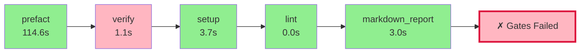

# Pyqual Pipeline Report

**Generated:** 2026-04-04 16:05:06
**Pipeline run:** 2026-04-04T14:05:06.687506+00:00

---

## 🔄 Pipeline Flow Diagram



## 📈 ASCII Visualization

```
┌─────────────────────────────────────────────────────────────────┐
│                    PYQUAL PIPELINE FLOW                         │
├─────────────────────────────────────────────────────────────────┤
│  ✓ prefact                    114.6s 🟢        │
│  ✗ verify                       1.1s 🔴        │
│  ✓ setup                        3.7s 🟢        │
│  ✓ lint                         0.0s 🟢        │
│  ✓ markdown_report              3.0s 🟢        │
├─────────────────────────────────────────────────────────────────┤
│  ❌ SOME GATES FAILED                                            │
│  ⏱️  Total time: 122.5s                                          │
└─────────────────────────────────────────────────────────────────┘
```

### 📊 Quality Gates

| Metric | Value | Threshold | Status |
|--------|-------|-----------|--------|
| coverage | 33.4% | >= 55.0% | ❌ FAIL |

### 🔧 Stage Execution Details

#### ✅ prefact
- **Status:** passed
- **Duration:** 114.6s
- **Return code:** 0

#### ❌ verify
- **Status:** failed
- **Duration:** 1.1s
- **Return code:** 2

#### ✅ setup
- **Status:** passed
- **Duration:** 3.7s
- **Return code:** 0

#### ✅ lint
- **Status:** passed
- **Duration:** 0.0s
- **Return code:** 0

#### ✅ markdown_report
- **Status:** passed
- **Duration:** 3.0s
- **Return code:** 0


---

## 📝 Summary

❌ **Some quality gates failed.** Review the stage details above.
