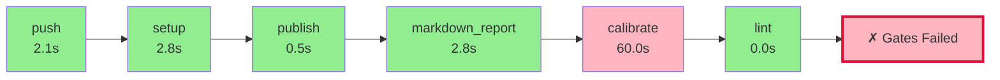

# Pyqual Pipeline Report

**Generated:** 2026-04-04 15:57:30
**Pipeline run:** 2026-04-04T13:57:28.968924+00:00

---

## 🔄 Pipeline Flow Diagram



## 📈 ASCII Visualization

```
┌─────────────────────────────────────────────────────────────────┐
│                    PYQUAL PIPELINE FLOW                         │
├─────────────────────────────────────────────────────────────────┤
│  ✓ push                         2.1s 🟢        │
│  ✓ setup                        2.8s 🟢        │
│  ✓ publish                      0.5s 🟢        │
│  ✓ markdown_report              2.8s 🟢        │
│  ✗ calibrate                   60.0s 🔴        │
│  ✓ lint                         0.0s 🟢        │
├─────────────────────────────────────────────────────────────────┤
│  ❌ SOME GATES FAILED                                            │
│  ⏱️  Total time: 68.2s                                          │
└─────────────────────────────────────────────────────────────────┘
```

### 📊 Quality Gates

| Metric | Value | Threshold | Status |
|--------|-------|-----------|--------|
| coverage | 34.4% | >= 55.0% | ❌ FAIL |

### 🔧 Stage Execution Details

#### ✅ push
- **Status:** passed
- **Duration:** 2.1s
- **Return code:** 0

#### ✅ setup
- **Status:** passed
- **Duration:** 2.8s
- **Return code:** 0

#### ✅ publish
- **Status:** passed
- **Duration:** 0.5s
- **Return code:** 0

#### ✅ markdown_report
- **Status:** passed
- **Duration:** 2.8s
- **Return code:** 0

#### ❌ calibrate
- **Status:** failed
- **Duration:** 60.0s
- **Return code:** 124

#### ✅ lint
- **Status:** passed
- **Duration:** 0.0s
- **Return code:** 0


---

## 📝 Summary

❌ **Some quality gates failed.** Review the stage details above.
