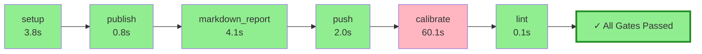

# Pyqual Pipeline Report

**Generated:** 2026-04-04 15:59:08
**Pipeline run:** 2026-04-04T13:59:08.612341+00:00

---

## 🔄 Pipeline Flow Diagram



## 📈 ASCII Visualization

```
┌─────────────────────────────────────────────────────────────────┐
│                    PYQUAL PIPELINE FLOW                         │
├─────────────────────────────────────────────────────────────────┤
│  ✓ setup                        3.8s 🟢        │
│  ✓ publish                      0.8s 🟢        │
│  ✓ markdown_report              4.1s 🟢        │
│  ✓ push                         2.0s 🟢        │
│  ✗ calibrate                   60.1s 🔴        │
│  ✓ lint                         0.1s 🟢        │
├─────────────────────────────────────────────────────────────────┤
│  🎉 ALL GATES PASSED ✓                                           │
│  ⏱️  Total time: 70.7s                                          │
└─────────────────────────────────────────────────────────────────┘
```

### 📊 Quality Gates

| Metric | Value | Threshold | Status |
|--------|-------|-----------|--------|

### 🔧 Stage Execution Details

#### ✅ setup
- **Status:** passed
- **Duration:** 3.8s
- **Return code:** 0

#### ✅ publish
- **Status:** passed
- **Duration:** 0.8s
- **Return code:** 0

#### ✅ markdown_report
- **Status:** passed
- **Duration:** 4.1s
- **Return code:** 0

#### ✅ push
- **Status:** passed
- **Duration:** 2.0s
- **Return code:** 0

#### ❌ calibrate
- **Status:** failed
- **Duration:** 60.1s
- **Return code:** 124

#### ✅ lint
- **Status:** passed
- **Duration:** 0.1s
- **Return code:** 0


---

## 📝 Summary

✅ **All quality gates passed!** Pipeline completed successfully in 70.7s.
