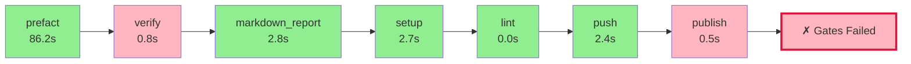

# Pyqual Pipeline Report

**Generated:** 2026-04-04 16:11:02
**Pipeline run:** 2026-04-04T14:11:00.224094+00:00

---

## 🔄 Pipeline Flow Diagram



## 📈 ASCII Visualization

```
┌─────────────────────────────────────────────────────────────────┐
│                    PYQUAL PIPELINE FLOW                         │
├─────────────────────────────────────────────────────────────────┤
│  ✓ prefact                     86.2s 🟢        │
│  ✗ verify                       0.8s 🔴        │
│  ✓ markdown_report              2.8s 🟢        │
│  ✓ setup                        2.7s 🟢        │
│  ✓ lint                         0.0s 🟢        │
│  ✓ push                         2.4s 🟢        │
│  ✗ publish                      0.5s 🔴        │
├─────────────────────────────────────────────────────────────────┤
│  ❌ SOME GATES FAILED                                            │
│  ⏱️  Total time: 95.3s                                          │
└─────────────────────────────────────────────────────────────────┘
```

### 📊 Quality Gates

| Metric | Value | Threshold | Status |
|--------|-------|-----------|--------|
| coverage | 33.4% | >= 55.0% | ❌ FAIL |

### 🔧 Stage Execution Details

#### ✅ prefact
- **Status:** passed
- **Duration:** 86.2s
- **Return code:** 0

#### ❌ verify
- **Status:** failed
- **Duration:** 0.8s
- **Return code:** 2

#### ✅ markdown_report
- **Status:** passed
- **Duration:** 2.8s
- **Return code:** 0

#### ✅ setup
- **Status:** passed
- **Duration:** 2.7s
- **Return code:** 0

#### ✅ lint
- **Status:** passed
- **Duration:** 0.0s
- **Return code:** 0

#### ✅ push
- **Status:** passed
- **Duration:** 2.4s
- **Return code:** 0

#### ❌ publish
- **Status:** failed
- **Duration:** 0.5s
- **Return code:** 2


---

## 📝 Summary

❌ **Some quality gates failed.** Review the stage details above.
