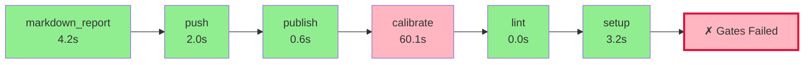

# Pyqual Pipeline Report

**Generated:** 2026-04-04 15:58:50
**Pipeline run:** 2026-04-04T13:58:49.690737+00:00

---

## 🔄 Pipeline Flow Diagram



## 📈 ASCII Visualization

```
┌─────────────────────────────────────────────────────────────────┐
│                    PYQUAL PIPELINE FLOW                         │
├─────────────────────────────────────────────────────────────────┤
│  ✓ markdown_report              4.2s 🟢        │
│  ✓ push                         2.0s 🟢        │
│  ✓ publish                      0.6s 🟢        │
│  ✗ calibrate                   60.1s 🔴        │
│  ✓ lint                         0.0s 🟢        │
│  ✓ setup                        3.2s 🟢        │
├─────────────────────────────────────────────────────────────────┤
│  ❌ SOME GATES FAILED                                            │
│  ⏱️  Total time: 70.1s                                          │
└─────────────────────────────────────────────────────────────────┘
```

### 📊 Quality Gates

| Metric | Value | Threshold | Status |
|--------|-------|-----------|--------|
| coverage | 32.9% | >= 55.0% | ❌ FAIL |

### 🔧 Stage Execution Details

#### ✅ markdown_report
- **Status:** passed
- **Duration:** 4.2s
- **Return code:** 0

#### ✅ push
- **Status:** passed
- **Duration:** 2.0s
- **Return code:** 0

#### ✅ publish
- **Status:** passed
- **Duration:** 0.6s
- **Return code:** 0

#### ❌ calibrate
- **Status:** failed
- **Duration:** 60.1s
- **Return code:** 124

#### ✅ lint
- **Status:** passed
- **Duration:** 0.0s
- **Return code:** 0

#### ✅ setup
- **Status:** passed
- **Duration:** 3.2s
- **Return code:** 0


---

## 📝 Summary

❌ **Some quality gates failed.** Review the stage details above.
