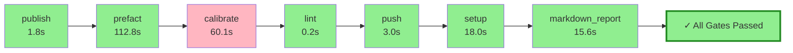

# Pyqual Pipeline Report

**Generated:** 2026-04-04 16:00:25
**Pipeline run:** 2026-04-04T14:00:24.019353+00:00

---

## 🔄 Pipeline Flow Diagram



## 📈 ASCII Visualization

```
┌─────────────────────────────────────────────────────────────────┐
│                    PYQUAL PIPELINE FLOW                         │
├─────────────────────────────────────────────────────────────────┤
│  ✓ publish                      1.8s 🟢        │
│  ✓ prefact                    112.8s 🟢        │
│  ✗ calibrate                   60.1s 🔴        │
│  ✓ lint                         0.2s 🟢        │
│  ✓ push                         3.0s 🟢        │
│  ✓ setup                       18.0s 🟢        │
│  ✓ markdown_report             15.6s 🟢        │
├─────────────────────────────────────────────────────────────────┤
│  🎉 ALL GATES PASSED ✓                                           │
│  ⏱️  Total time: 211.5s                                          │
└─────────────────────────────────────────────────────────────────┘
```

### 📊 Quality Gates

| Metric | Value | Threshold | Status |
|--------|-------|-----------|--------|
| coverage | 89.5% | >= 55.0% | ✅ PASS |

### 🔧 Stage Execution Details

#### ✅ publish
- **Status:** passed
- **Duration:** 1.8s
- **Return code:** 0

#### ✅ prefact
- **Status:** passed
- **Duration:** 112.8s
- **Return code:** 0

#### ❌ calibrate
- **Status:** failed
- **Duration:** 60.1s
- **Return code:** 124

#### ✅ lint
- **Status:** passed
- **Duration:** 0.2s
- **Return code:** 0

#### ✅ push
- **Status:** passed
- **Duration:** 3.0s
- **Return code:** 0

#### ✅ setup
- **Status:** passed
- **Duration:** 18.0s
- **Return code:** 0

#### ✅ markdown_report
- **Status:** passed
- **Duration:** 15.6s
- **Return code:** 0


---

## 📝 Summary

✅ **All quality gates passed!** Pipeline completed successfully in 211.5s.
