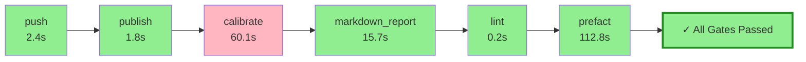

# Pyqual Pipeline Report

**Generated:** 2026-04-04 16:00:16
**Pipeline run:** 2026-04-04T14:00:15.380621+00:00

---

## 🔄 Pipeline Flow Diagram



## 📈 ASCII Visualization

```
┌─────────────────────────────────────────────────────────────────┐
│                    PYQUAL PIPELINE FLOW                         │
├─────────────────────────────────────────────────────────────────┤
│  ✓ push                         2.4s 🟢        │
│  ✓ publish                      1.8s 🟢        │
│  ✗ calibrate                   60.1s 🔴        │
│  ✓ markdown_report             15.7s 🟢        │
│  ✓ lint                         0.2s 🟢        │
│  ✓ prefact                    112.8s 🟢        │
├─────────────────────────────────────────────────────────────────┤
│  🎉 ALL GATES PASSED ✓                                           │
│  ⏱️  Total time: 193.0s                                          │
└─────────────────────────────────────────────────────────────────┘
```

### 📊 Quality Gates

| Metric | Value | Threshold | Status |
|--------|-------|-----------|--------|

### 🔧 Stage Execution Details

#### ✅ push
- **Status:** passed
- **Duration:** 2.4s
- **Return code:** 0

#### ✅ publish
- **Status:** passed
- **Duration:** 1.8s
- **Return code:** 0

#### ❌ calibrate
- **Status:** failed
- **Duration:** 60.1s
- **Return code:** 124

#### ✅ markdown_report
- **Status:** passed
- **Duration:** 15.7s
- **Return code:** 0

#### ✅ lint
- **Status:** passed
- **Duration:** 0.2s
- **Return code:** 0

#### ✅ prefact
- **Status:** passed
- **Duration:** 112.8s
- **Return code:** 0


---

## 📝 Summary

✅ **All quality gates passed!** Pipeline completed successfully in 193.0s.
