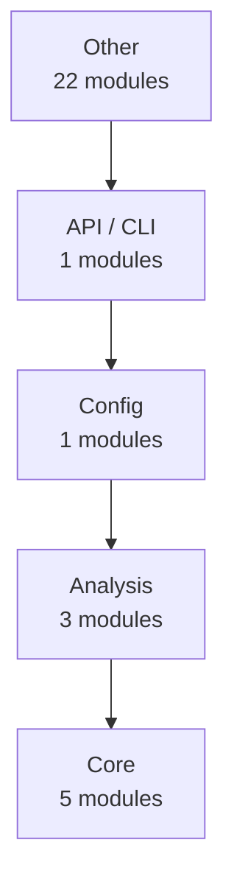

# fixOS — Architecture

> 32 modules | 203 functions | 31 classes

## How It Works

`fixOS` analyzes source code via a multi-stage pipeline:

```
Source files  ──►  code2llm (tree-sitter + AST)  ──►  AnalysisResult
                                                          │
              ┌───────────────────────────────────────────┘
              ▼
    ┌─────────────────────┐
    │   12 Generators     │
    │  ─────────────────  │
    │  README.md          │
    │  docs/api/          │
    │  docs/modules/      │
    │  docs/architecture   │
    │  docs/coverage      │
    │  examples/          │
    │  mkdocs.yml         │
    │  CONTRIBUTING.md    │
    └─────────────────────┘
```

**Analysis algorithms:**

1. **AST parsing** — language-specific parsers (tree-sitter) extract syntax trees
2. **Cyclomatic complexity** — counts independent code paths per function
3. **Fan-in / fan-out** — measures module coupling (how many modules import/are imported by each)
4. **Docstring extraction** — parses Google/NumPy/Sphinx-style docstrings into structured data
5. **Pattern detection** — identifies design patterns (Factory, Singleton, Observer, etc.)
6. **Dependency scanning** — reads pyproject.toml / requirements.txt / setup.py

## Architecture Layers



### Other

- `docs.examples.advanced_usage`
- `docs.examples.quickstart`
- `fixos`
- `fixos.agent`
- `fixos.agent.autonomous`
- `fixos.agent.hitl`
- `fixos.anonymizer`
- `fixos.diagnostics`
- `fixos.diagnostics.system_checks`
- `fixos.fixes`
- `fixos.interactive`
- `fixos.interactive.cleanup_planner`
- `fixos.llm_shell`
- `fixos.orchestrator`
- `fixos.orchestrator.executor`
- `fixos.orchestrator.graph`
- `fixos.orchestrator.orchestrator`
- `fixos.providers`
- `fixos.providers.llm`
- `fixos.system_checks`
- `project`
- `setup`

### API / CLI

- `fixos.cli`

### Config

- `fixos.config`

### Analysis

- `fixos.diagnostics.disk_analyzer`
- `fixos.diagnostics.service_scanner`
- `fixos.providers.llm_analyzer`

### Core

- `fixos.platform_utils`
- `fixos.utils`
- `fixos.utils.anonymizer`
- `fixos.utils.terminal`
- `fixos.utils.web_search`

## Module Dependency Graph


## Key Classes

```mermaid
classDiagram
    class ServiceDataScanner {
        -__init__(self, threshold_mb) None
        +scan_all_services(self) None
        +scan_service(self, service_type) None
        -_analyze_service_path(self, service_type, path) None
        -_get_path_size_mb(self, path) None
        -_get_service_details(self, service_type, path) None
        -_get_conda_details(self) None
        -_get_docker_details(self) None
        ... +9 more
    }
    class DiskAnalyzer {
        -__init__(self, base_path) None
        +analyze_disk_usage(self, path) None
        -_get_disk_status(self, usage_percent) None
        +get_large_files(self, path, min_size_mb) None
        +get_cache_dirs(self, path, max_dirs) None
        +get_log_dirs(self, path, max_dirs) None
        +get_temp_dirs(self, path, max_dirs) None
        +suggest_cleanup_actions(self, path) None
        ... +6 more
    }
    class FixOrchestrator {
        -__init__(self, config, executor) None
        +load_from_diagnostics(self, diagnostics) None
        +load_from_dict(self, problems_data) None
        +run_sync(self, confirm_fn, progress_fn) None
        +run_async(self, confirm_fn, progress_fn) None
        -_evaluate_and_rediagnose(self, problem, result) None
        -_parse_json(self, raw) None
        -_log(self, event, data) None
        ... +3 more
    }
    class CleanupPlanner {
        -__init__(self) None
        +group_by_category(self, suggestions) None
        +prioritize_actions(self, grouped_actions) None
        +create_cleanup_plan(self, suggestions) None
        +interactive_selection(self, plan) None
        -_dict_to_action(self, suggestion) None
        -_action_to_dict(self, action) None
        -_get_category_for_action(self, action) None
        ... +2 more
    }
    class ProblemGraph {
        -__init__(self) None
        +add(self, problem) None
        +get(self, problem_id) None
        +next_actionable(self) None
        +all_done(self) None
        +pending_count(self) None
        +summary(self) None
        +render_tree(self) None
        ... +1 more
    }
    class CommandExecutor {
        -__init__(self, default_timeout, require_confirmation) None
        +is_dangerous(self, command) None
        +needs_sudo(self, command) None
        +add_sudo(self, command) None
        -_make_noninteractive(self, command) None
        +check_idempotent(self, command) None
        +execute_sync(self, command, timeout) None
        +execute(self, command, timeout) None
    }
    class LLMAnalyzer {
        -__init__(self, llm_client) None
        +analyze_disk_issues(self, disk_data) None
        +analyze_failed_action(self, action, error) None
        +analyze_complex_pattern(self, pattern_data) None
        -_sanitize_suggestion(self, suggestion) None
        -_create_fallback_analysis(self, error_message) None
        +enhance_heuristics_with_llm(self, heuristic_suggestions, disk_data) None
    }
    class LLMClient {
        -__init__(self, config) None
        +chat(self, messages) None
        +chat_stream(self, messages) None
        +fixos.providers.llm.LLMClient.total_tokens()
        +ping(self) None
    }
    class FixOsConfig {
        +load(cls) None
        +validate(self) None
        +summary(self) None
    }
    class AnonymizationReport {
        +add(self, category, count) None
        +summary(self) None
    }
    class ExecutionResult {
        +fixos.orchestrator.executor.ExecutionResult.success()
        +to_context(self) None
    }
    class Problem {
        +is_actionable(self) None
        +to_summary(self) None
    }
    class NaturalLanguageGroup {
        +resolve_command(self, ctx, args) None
    }
    class AgentReport {
        +summary(self) None
    }
    class DangerousCommandError {
        -__init__(self, command, reason) None
    }
```



## Detected Patterns

- **recursion__dict_to_markdown** (recursion) — confidence: 90%, functions: `fixos.utils.anonymizer._dict_to_markdown`

## Public Entry Points

- `fixos.platform_utils.install_package_cmd` — Returns the install command for the detected package manager.
- `fixos.llm_shell.run_llm_shell` — Uruchamia interaktywny shell LLM z przekazanymi danymi diagnostycznymi.
- `fixos.diagnostics.system_checks.diagnose_audio` — Diagnostyka dźwięku (ALSA/PipeWire/PulseAudio/SOF).
- `fixos.diagnostics.system_checks.diagnose_thumbnails` — Diagnostyka podglądów plików (thumbnails) w system.
- `fixos.diagnostics.system_checks.diagnose_hardware` — Diagnostyka sprzętu laptopa/desktopa (ACPI, kamera, touchpad, DMI).
- `fixos.diagnostics.system_checks.diagnose_system` — System metrics – cross-platform: CPU, RAM, disks, processes.
- `fixos.diagnostics.system_checks.diagnose_security` — Diagnostyka bezpieczeństwa systemu i sieci.
- `fixos.diagnostics.system_checks.diagnose_resources` — Diagnostyka zasobów systemowych.
- `fixos.diagnostics.system_checks.get_full_diagnostics` — Zbiera diagnostykę z wybranych modułów.
- `fixos.diagnostics.disk_analyzer.main` — Test the disk analyzer
- `fixos.cli.add_common_options`
- `fixos.cli.add_shared_options` — Shared options for both scan and fix commands
- `fixos.cli.ask` — Wykonaj polecenie w języku naturalnym.
- `fixos.cli.scan` — Przeprowadza diagnostykę systemu.
- `fixos.cli.fix` — Przeprowadza pełną diagnostykę i uruchamia sesję naprawczą z LLM.
- `fixos.cli.token` — Zarządzanie tokenami API LLM.
- `fixos.cli.token_set` — Zapisuje token API do pliku .env.
- `fixos.cli.token_show` — Pokazuje aktualnie skonfigurowany token (zamaskowany).
- `fixos.cli.token_clear` — Usuwa token z pliku .env.
- `fixos.cli.config` — Zarządzanie konfiguracją fixos.
- `fixos.cli.config_show` — Wyświetla aktualną konfigurację.
- `fixos.cli.config_init` — Tworzy plik .env na podstawie szablonu .env.example.
- `fixos.cli.config_set` — Ustawia wartość w pliku .env.
- `fixos.cli.llm_providers` — Lista providerów LLM z linkami do generowania kluczy API.
- `fixos.cli.providers` — Lista dostępnych providerów LLM (skrócona). Użyj 'fixos llm' po więcej.
- `fixos.cli.test_llm` — Testuje połączenie z wybranym providerem LLM.
- `fixos.cli.orchestrate` — Orkiestracja napraw z grafem kaskadowych problemów.
- `fixos.cli.cleanup_services` — Skanuje i czyści dane usług przekraczające próg.
- `fixos.cli.main`
- `fixos.config.detect_provider_from_key` — Wykrywa provider na podstawie prefiksu klucza API.
- `fixos.utils.anonymizer.anonymize` — Anonimizuje wrażliwe dane.
- `fixos.utils.terminal.colorize` — Return line unchanged – rich handles markup in render_md().
- `fixos.utils.terminal.render_md` — Print LLM markdown reply to terminal via rich.
- `fixos.diagnostics.service_scanner.main` — Test the service data scanner
- `fixos.interactive.cleanup_planner.main` — Test the cleanup planner
- `fixos.providers.llm_analyzer.main` — Test the LLM analyzer

## Metrics Summary

| Metric | Value |
|--------|-------|
| Modules | 32 |
| Functions | 203 |
| Classes | 31 |
| CFG Nodes | 1261 |
| Patterns | 1 |
| Avg Complexity | 6.0 |
| Analysis Time | 3.49s |
