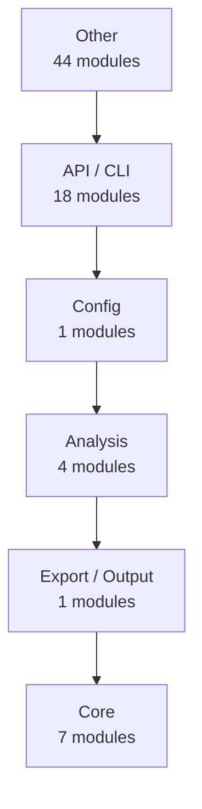

# fixOS — Architecture

> 75 modules | 379 functions | 66 classes

## How It Works

`fixOS` analyzes source code via a multi-stage pipeline:

```
Source files  ──►  code2llm (tree-sitter + AST)  ──►  AnalysisResult
                                                          │
              ┌───────────────────────────────────────────┘
              ▼
    ┌─────────────────────┐
    │   12 Generators     │
    │  ─────────────────  │
    │  README.md          │
    │  docs/api/          │
    │  docs/modules/      │
    │  docs/architecture   │
    │  docs/coverage      │
    │  examples/          │
    │  mkdocs.yml         │
    │  CONTRIBUTING.md    │
    └─────────────────────┘
```

**Analysis algorithms:**

1. **AST parsing** — language-specific parsers (tree-sitter) extract syntax trees
2. **Cyclomatic complexity** — counts independent code paths per function
3. **Fan-in / fan-out** — measures module coupling (how many modules import/are imported by each)
4. **Docstring extraction** — parses Google/NumPy/Sphinx-style docstrings into structured data
5. **Pattern detection** — identifies design patterns (Factory, Singleton, Observer, etc.)
6. **Dependency scanning** — reads pyproject.toml / requirements.txt / setup.py

## Architecture Layers



### Other

- `docs.examples.advanced_usage`
- `docs.examples.quickstart`
- `fixos`
- `fixos.agent`
- `fixos.agent.autonomous`
- `fixos.agent.autonomous_session`
- `fixos.agent.hitl`
- `fixos.agent.hitl_session`
- `fixos.anonymizer`
- `fixos.diagnostics`
- `fixos.diagnostics.service_cleanup`
- `fixos.diagnostics.service_details`
- `fixos.diagnostics.system_checks`
- `fixos.features`
- `fixos.features.auditor`
- `fixos.features.catalog`
- `fixos.features.installer`
- `fixos.features.profiles`
- `fixos.fixes`
- `fixos.interactive`
- `fixos.interactive.cleanup_planner`
- `fixos.llm_shell`
- `fixos.orchestrator`
- `fixos.orchestrator.executor`
- `fixos.orchestrator.graph`
- `fixos.orchestrator.orchestrator`
- `fixos.orchestrator.rollback`
- `fixos.plugins`
- `fixos.plugins.builtin`
- `fixos.plugins.builtin.audio`
- `fixos.plugins.builtin.disk`
- `fixos.plugins.builtin.hardware`
- `fixos.plugins.builtin.resources`
- `fixos.plugins.builtin.security`
- `fixos.plugins.builtin.thumbnails`
- `fixos.plugins.registry`
- `fixos.profiles`
- `fixos.providers`
- `fixos.providers.llm`
- `fixos.providers.schemas`
- `fixos.system_checks`
- `fixos.watch`
- `project`
- `setup`

### API / CLI

- `fixos.cli`
- `fixos.cli.ask_cmd`
- `fixos.cli.cleanup_cmd`
- `fixos.cli.config_cmd`
- `fixos.cli.features_cmd`
- `fixos.cli.fix_cmd`
- `fixos.cli.history_cmd`
- `fixos.cli.main`
- `fixos.cli.orchestrate_cmd`
- `fixos.cli.profile_cmd`
- `fixos.cli.provider_cmd`
- `fixos.cli.quickfix_cmd`
- `fixos.cli.report_cmd`
- `fixos.cli.rollback_cmd`
- `fixos.cli.scan_cmd`
- `fixos.cli.shared`
- `fixos.cli.token_cmd`
- `fixos.cli.watch_cmd`

### Config

- `fixos.config`

### Analysis

- `fixos.diagnostics.disk_analyzer`
- `fixos.diagnostics.flatpak_analyzer`
- `fixos.diagnostics.service_scanner`
- `fixos.providers.llm_analyzer`

### Export / Output

- `fixos.features.renderer`

### Core

- `fixos.platform_utils`
- `fixos.plugins.base`
- `fixos.utils`
- `fixos.utils.anonymizer`
- `fixos.utils.terminal`
- `fixos.utils.timeout`
- `fixos.utils.web_search`

## Module Dependency Graph


## Key Classes

```mermaid
classDiagram
    class AutonomousSession {
        -__init__(self, diagnostics, config) None
        -_setup_timeout(self) None
        -_clear_timeout(self) None
        -_confirm_start(self) None
        -_initialize_messages(self) None
        -_get_remaining_time(self) None
        -_check_timeout(self) None
        -_query_llm(self) None
        ... +12 more
    }
    class HITLSession {
        -__init__(self, diagnostics, config) None
        -_setup_timeout(self) None
        -_clear_timeout(self) None
        +remaining(self) None
        +fmt_time(s) None
        -_initialize_messages(self) None
        -_print_header(self) None
        -_extract_fixes(reply) None
        ... +11 more
    }
    class DiskAnalyzer {
        -__init__(self, base_path) None
        +analyze_disk_usage(self, path) None
        -_get_disk_status(self, usage_percent) None
        +get_large_files(self, path, min_size_mb) None
        +get_cache_dirs(self, path, max_dirs) None
        +get_log_dirs(self, path, max_dirs) None
        +get_temp_dirs(self, path, max_dirs) None
        +suggest_cleanup_actions(self, path) None
        ... +6 more
    }
    class SystemDetector {
        +detect(self) None
        -_detect_os_family(self) None
        -_detect_distro(self) None
        -_detect_distro_version(self) None
        -_detect_id_like(self) None
        -_detect_de(self) None
        -_detect_display_server(self) None
        -_detect_gpu_vendor(self) None
        ... +4 more
    }
    class FeatureInstaller {
        -__init__(self, system, dry_run) None
        +install(self, packages) None
        -_install_package(self, pkg) None
        -_install_repo(self, pkg) None
        -_install_native(self, packages) None
        -_install_flatpak(self, app_id) None
        -_install_pip(self, package) None
        -_install_cargo(self, package) None
        ... +3 more
    }
    class FixOrchestrator {
        -__init__(self, config, executor) None
        +load_from_diagnostics(self, diagnostics) None
        +load_from_dict(self, problems_data) None
        +run_sync(self, confirm_fn, progress_fn) None
        +run_async(self, confirm_fn, progress_fn) None
        -_evaluate_and_rediagnose(self, problem, result) None
        -_parse_json(self, raw) None
        -_log(self, event, data) None
        ... +3 more
    }
    class FlatpakAnalyzer {
        -__init__(self) None
        +analyze(self) None
        -_run_flatpak_command(self, args) None
        -_parse_size(self, size_str) None
        -_format_size(self, size_bytes) None
        -_load_installed_refs(self) None
        -_find_unused_runtimes(self) None
        -_find_leftover_data(self) None
        ... +2 more
    }
    class CleanupPlanner {
        -__init__(self) None
        +group_by_category(self, suggestions) None
        +prioritize_actions(self, grouped_actions) None
        +create_cleanup_plan(self, suggestions) None
        +interactive_selection(self, plan) None
        -_dict_to_action(self, suggestion) None
        -_action_to_dict(self, action) None
        -_get_category_for_action(self, action) None
        ... +2 more
    }
    class PluginRegistry {
        -__init__(self) None
        +discover(self) None
        -_register_builtins(self) None
        -_register_external(self) None
        +register(self, plugin) None
        +list_plugins(self, runnable_only) None
        +get_plugin(self, name) None
        +run(self, modules, progress_callback) None
        ... +1 more
    }
    class ProblemGraph {
        -__init__(self) None
        +add(self, problem) None
        +get(self, problem_id) None
        +next_actionable(self) None
        +all_done(self) None
        +pending_count(self) None
        +summary(self) None
        +render_tree(self) None
        ... +1 more
    }
    class ServiceCleaner {
        -__init__(self, scanner) None
        +get_cleanup_plan(self, selected_services) None
        +cleanup_service(self, service_type, dry_run) None
        -_service_to_dict(service) None
        +is_safe_cleanup(service_type) None
        +get_service_description(service_type) None
        +get_cleanup_command(service_type, path) None
        +get_preview_command(service_type, path) None
    }
    class CommandExecutor {
        -__init__(self, default_timeout, require_confirmation) None
        +is_dangerous(self, command) None
        +needs_sudo(self, command) None
        +add_sudo(self, command) None
        -_make_noninteractive(self, command) None
        +check_idempotent(self, command) None
        +execute_sync(self, command, timeout) None
        +execute(self, command, timeout) None
    }
    class ServiceDetailsProvider {
        +get_details(self, service_type, path) None
        -_docker(self) None
        -_ollama(self) None
        -_conda(self) None
        -_package_cache(self, path) None
        -_flatpak(self) None
        -_parse_size_bytes(size_str) None
    }
    class ServiceDataScanner {
        -__init__(self, threshold_mb) None
        +scan_all_services(self) None
        +scan_service(self, service_type) None
        -_analyze_service_path(self, service_type, path) None
        -_get_path_size_mb(self, path) None
        +get_cleanup_plan(self, selected_services) None
        +cleanup_service(self, service_type, dry_run) None
    }
    class LLMClient {
        -__init__(self, config) None
        +chat(self, messages) None
        +chat_stream(self, messages) None
        +fixos.providers.llm.LLMClient.total_tokens()
        +chat_structured(self, messages, response_model) None
        -_extract_json(text) None
        +ping(self) None
    }
```



## Detected Patterns

- **recursion__dict_to_markdown** (recursion) — confidence: 90%, functions: `fixos.utils.anonymizer._dict_to_markdown`

## Public Entry Points

- `fixos.platform_utils.install_package_cmd` — Returns the install command for the detected package manager.
- `fixos.llm_shell.run_llm_shell` — Uruchamia interaktywny shell LLM z przekazanymi danymi diagnostycznymi.
- `fixos.diagnostics.system_checks.diagnose_audio` — Diagnostyka dźwięku (ALSA/PipeWire/PulseAudio/SOF).
- `fixos.diagnostics.system_checks.diagnose_thumbnails` — Diagnostyka podglądów plików (thumbnails) w system.
- `fixos.diagnostics.system_checks.diagnose_hardware` — Diagnostyka sprzętu laptopa/desktopa (ACPI, kamera, touchpad, DMI).
- `fixos.diagnostics.system_checks.diagnose_system` — System metrics – cross-platform: CPU, RAM, disks, processes.
- `fixos.diagnostics.system_checks.diagnose_security` — Diagnostyka bezpieczeństwa systemu i sieci.
- `fixos.diagnostics.system_checks.diagnose_resources` — Diagnostyka zasobów systemowych.
- `fixos.diagnostics.system_checks.get_full_diagnostics` — Zbiera diagnostykę z wybranych modułów.
- `fixos.diagnostics.disk_analyzer.main` — Test the disk analyzer
- `fixos.config.get_providers_list` — Zwraca listę providerów jako listę słowników.
- `fixos.agent.hitl_session.run_hitl_session` — Run interactive HITL session (backward compatible wrapper).
- `fixos.diagnostics.flatpak_analyzer.analyze_flatpak_for_cleanup` — Convenience function to run full Flatpak analysis
- `fixos.diagnostics.service_scanner.main` — Test the service data scanner.
- `fixos.agent.autonomous_session.run_autonomous_session` — Run autonomous session (backward compatible wrapper).
- `fixos.cli.profile_cmd.profile` — Zarządzanie profilami diagnostycznymi.
- `fixos.cli.profile_cmd.profile_list` — Pokaż dostępne profile diagnostyczne.
- `fixos.cli.profile_cmd.profile_show` — Pokaż szczegóły profilu diagnostycznego.
- `fixos.cli.quickfix_cmd.quickfix` — Natychmiastowe naprawy bez API — baza znanych bugów.
- `fixos.cli.scan_cmd.scan` — Przeprowadza diagnostykę systemu.
- `fixos.cli.orchestrate_cmd.orchestrate` — Zaawansowana orkiestracja napraw z grafem problemów.
- `fixos.cli.report_cmd.report` — Eksport wyników diagnostyki do raportu HTML/Markdown/JSON.
- `fixos.cli.rollback_cmd.rollback` — Zarządzanie cofaniem operacji fixOS.
- `fixos.cli.rollback_cmd.rollback_list` — Pokaż historię sesji naprawczych.
- `fixos.cli.rollback_cmd.rollback_show` — Pokaż szczegóły sesji rollback.
- `fixos.cli.rollback_cmd.rollback_undo` — Cofnij operacje z podanej sesji.
- `fixos.cli.ask_cmd.ask` — Wykonaj polecenie w języku naturalnym.
- `fixos.cli.history_cmd.history` — Historia napraw fixOS.
- `fixos.cli.cleanup_cmd.cleanup_services` — Skanuje i czyści dane usług przekraczające próg.
- `fixos.cli.watch_cmd.watch` — Monitorowanie systemu w tle z powiadomieniami.
- `fixos.cli.fix_cmd.fix` — Przeprowadza pełną diagnostykę i uruchamia sesję naprawczą z LLM.
- `fixos.cli.token_cmd.token` — Zarządzanie tokenem API.
- `fixos.cli.token_cmd.token_set` — Zapisz token API do pliku .env.
- `fixos.cli.token_cmd.token_show` — Pokaż obecny token (masked).
- `fixos.cli.token_cmd.token_clear` — Usuń token z pliku .env.
- `fixos.cli.main.main` — Entry point for fixOS CLI.
- `fixos.cli.config_cmd.config` — Zarządzanie konfiguracją fixOS.
- `fixos.cli.config_cmd.config_show` — Pokaż aktualną konfigurację.
- `fixos.cli.config_cmd.config_init` — Zainicjalizuj plik konfiguracyjny .env.
- `fixos.cli.config_cmd.config_set` — Ustaw wartość konfiguracyjną w .env.
- `fixos.cli.features_cmd.features` — Zarządzanie pakietami komfortu systemu.
- `fixos.cli.features_cmd.features_audit` — Sprawdź brakujące pakiety dla profilu.
- `fixos.cli.features_cmd.features_install` — Zainstaluj brakujące pakiety dla profilu.
- `fixos.cli.features_cmd.features_profiles` — Lista dostępnych profili.
- `fixos.cli.features_cmd.features_system` — Pokaż wykryty system.
- `fixos.cli.provider_cmd.llm_providers` — Lista dostępnych providerów LLM.
- `fixos.cli.provider_cmd.providers` — Lista providerów LLM z oznaczeniem FREE/PAID.
- `fixos.cli.provider_cmd.test_llm` — Test połączenia z LLM.
- `fixos.providers.llm_analyzer.main` — Test the LLM analyzer
- `fixos.utils.timeout.timeout_handler` — Signal handler dla SIGALRM — rzuca SessionTimeout.
- `fixos.utils.anonymizer.anonymize` — Anonimizuje wrażliwe dane.
- `fixos.utils.terminal.colorize` — Return line unchanged – rich handles markup in render_md().
- `fixos.utils.terminal.render_md` — Print LLM markdown reply to terminal via rich.
- `fixos.utils.terminal.render_tree_colored` — Render a ProblemGraph as a rich-markup string.
- `fixos.cli.shared.add_common_options` — Decorator adding common LLM options to a Click command.
- `fixos.cli.shared.add_shared_options` — Shared options for both scan and fix commands.
- `fixos.interactive.cleanup_planner.main` — Test the cleanup planner

## Metrics Summary

| Metric | Value |
|--------|-------|
| Modules | 75 |
| Functions | 379 |
| Classes | 66 |
| CFG Nodes | 2363 |
| Patterns | 1 |
| Avg Complexity | 5.0 |
| Analysis Time | 4.09s |
