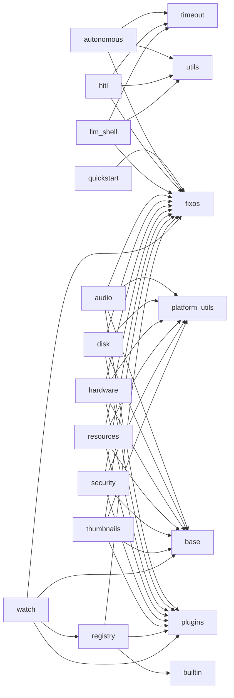

# fixOS — Dependency Graph

> 48 modules, 41 dependency edges

## Module Dependencies

## Coupling Matrix

| | advanced_usage | quickstart | fixos | agent | autonomous | hitl | anonymizer | cli | config | diagnostics | disk_analyzer | flatpak_analyzer | service_scanner | system_checks | fixes | interactive | cleanup_planner | llm_shell | orchestrator | executor | graph | orchestrator | rollback | platform_utils | plugins | base | builtin | audio | disk | hardware | resources | security | thumbnails | registry | profiles | providers | llm | llm_analyzer | schemas | system_checks | utils | anonymizer | terminal | timeout | web_search | watch | project | setup |
| --- | --- | --- | --- | --- | --- | --- | --- | --- | --- | --- | --- | --- | --- | --- | --- | --- | --- | --- | --- | --- | --- | --- | --- | --- | --- | --- | --- | --- | --- | --- | --- | --- | --- | --- | --- | --- | --- | --- | --- | --- | --- | --- | --- | --- | --- | --- | --- | --- |
| **advanced_usage** | · |  |  |  |  |  |  |  |  |  |  |  |  |  |  |  |  |  |  |  |  |  |  |  |  |  |  |  |  |  |  |  |  |  |  |  |  |  |  |  |  |  |  |  |  |  |  |  |
| **quickstart** |  | · | → |  |  |  |  |  |  |  |  |  |  |  |  |  |  |  |  |  |  |  |  |  |  |  |  |  |  |  |  |  |  |  |  |  |  |  |  |  |  |  |  |  |  |  |  |  |
| **fixos** |  |  | · |  |  |  |  |  |  |  |  |  |  |  |  |  |  |  |  |  |  |  |  |  |  |  |  |  |  |  |  |  |  |  |  |  |  |  |  |  |  |  |  |  |  |  |  |  |
| **agent** |  |  |  | · |  |  |  |  |  |  |  |  |  |  |  |  |  |  |  |  |  |  |  |  |  |  |  |  |  |  |  |  |  |  |  |  |  |  |  |  |  |  |  |  |  |  |  |  |
| **autonomous** |  |  | → |  | · |  |  |  |  |  |  |  |  |  |  |  |  |  |  |  |  |  |  |  |  |  |  |  |  |  |  |  |  |  |  |  |  |  |  |  | → |  |  | → |  |  |  |  |
| **hitl** |  |  | → |  |  | · |  |  |  |  |  |  |  |  |  |  |  |  |  |  |  |  |  |  |  |  |  |  |  |  |  |  |  |  |  |  |  |  |  |  | → |  |  | → |  |  |  |  |
| **anonymizer** |  |  |  |  |  |  | · |  |  |  |  |  |  |  |  |  |  |  |  |  |  |  |  |  |  |  |  |  |  |  |  |  |  |  |  |  |  |  |  |  |  |  |  |  |  |  |  |  |
| **cli** |  |  |  |  |  |  |  | · |  |  |  |  |  |  |  |  |  |  |  |  |  |  |  |  |  |  |  |  |  |  |  |  |  |  |  |  |  |  |  |  |  |  |  |  |  |  |  |  |
| **config** |  |  |  |  |  |  |  |  | · |  |  |  |  |  |  |  |  |  |  |  |  |  |  |  |  |  |  |  |  |  |  |  |  |  |  |  |  |  |  |  |  |  |  |  |  |  |  |  |
| **diagnostics** |  |  |  |  |  |  |  |  |  | · |  |  |  |  |  |  |  |  |  |  |  |  |  |  |  |  |  |  |  |  |  |  |  |  |  |  |  |  |  |  |  |  |  |  |  |  |  |  |
| **disk_analyzer** |  |  |  |  |  |  |  |  |  |  | · |  |  |  |  |  |  |  |  |  |  |  |  |  |  |  |  |  |  |  |  |  |  |  |  |  |  |  |  |  |  |  |  |  |  |  |  |  |
| **flatpak_analyzer** |  |  |  |  |  |  |  |  |  |  |  | · |  |  |  |  |  |  |  |  |  |  |  |  |  |  |  |  |  |  |  |  |  |  |  |  |  |  |  |  |  |  |  |  |  |  |  |  |
| **service_scanner** |  |  |  |  |  |  |  |  |  |  |  |  | · |  |  |  |  |  |  |  |  |  |  |  |  |  |  |  |  |  |  |  |  |  |  |  |  |  |  |  |  |  |  |  |  |  |  |  |
| **system_checks** |  |  |  |  |  |  |  |  |  |  |  |  |  | · |  |  |  |  |  |  |  |  |  |  |  |  |  |  |  |  |  |  |  |  |  |  |  |  |  |  |  |  |  |  |  |  |  |  |
| **fixes** |  |  |  |  |  |  |  |  |  |  |  |  |  |  | · |  |  |  |  |  |  |  |  |  |  |  |  |  |  |  |  |  |  |  |  |  |  |  |  |  |  |  |  |  |  |  |  |  |
| **interactive** |  |  |  |  |  |  |  |  |  |  |  |  |  |  |  | · |  |  |  |  |  |  |  |  |  |  |  |  |  |  |  |  |  |  |  |  |  |  |  |  |  |  |  |  |  |  |  |  |
| **cleanup_planner** |  |  |  |  |  |  |  |  |  |  |  |  |  |  |  |  | · |  |  |  |  |  |  |  |  |  |  |  |  |  |  |  |  |  |  |  |  |  |  |  |  |  |  |  |  |  |  |  |
| **llm_shell** |  |  | → |  |  |  |  |  |  |  |  |  |  |  |  |  |  | · |  |  |  |  |  |  |  |  |  |  |  |  |  |  |  |  |  |  |  |  |  |  | → |  |  | → |  |  |  |  |
| **orchestrator** |  |  |  |  |  |  |  |  |  |  |  |  |  |  |  |  |  |  | · |  |  |  |  |  |  |  |  |  |  |  |  |  |  |  |  |  |  |  |  |  |  |  |  |  |  |  |  |  |
| **executor** |  |  |  |  |  |  |  |  |  |  |  |  |  |  |  |  |  |  |  | · |  |  |  |  |  |  |  |  |  |  |  |  |  |  |  |  |  |  |  |  |  |  |  |  |  |  |  |  |
| **graph** |  |  |  |  |  |  |  |  |  |  |  |  |  |  |  |  |  |  |  |  | · |  |  |  |  |  |  |  |  |  |  |  |  |  |  |  |  |  |  |  |  |  |  |  |  |  |  |  |
| **orchestrator** |  |  |  |  |  |  |  |  |  |  |  |  |  |  |  |  |  |  |  |  |  | · |  |  |  |  |  |  |  |  |  |  |  |  |  |  |  |  |  |  |  |  |  |  |  |  |  |  |
| **rollback** |  |  |  |  |  |  |  |  |  |  |  |  |  |  |  |  |  |  |  |  |  |  | · |  |  |  |  |  |  |  |  |  |  |  |  |  |  |  |  |  |  |  |  |  |  |  |  |  |
| **platform_utils** |  |  |  |  |  |  |  |  |  |  |  |  |  |  |  |  |  |  |  |  |  |  |  | · |  |  |  |  |  |  |  |  |  |  |  |  |  |  |  |  |  |  |  |  |  |  |  |  |
| **plugins** |  |  |  |  |  |  |  |  |  |  |  |  |  |  |  |  |  |  |  |  |  |  |  |  | · |  |  |  |  |  |  |  |  |  |  |  |  |  |  |  |  |  |  |  |  |  |  |  |
| **base** |  |  |  |  |  |  |  |  |  |  |  |  |  |  |  |  |  |  |  |  |  |  |  |  |  | · |  |  |  |  |  |  |  |  |  |  |  |  |  |  |  |  |  |  |  |  |  |  |
| **builtin** |  |  |  |  |  |  |  |  |  |  |  |  |  |  |  |  |  |  |  |  |  |  |  |  |  |  | · |  |  |  |  |  |  |  |  |  |  |  |  |  |  |  |  |  |  |  |  |  |
| **audio** |  |  | → |  |  |  |  |  |  |  |  |  |  |  |  |  |  |  |  |  |  |  |  | → | → | → |  | · |  |  |  |  |  |  |  |  |  |  |  |  |  |  |  |  |  |  |  |  |
| **disk** |  |  | → |  |  |  |  |  |  |  |  |  |  |  |  |  |  |  |  |  |  |  |  | → | → | → |  |  | · |  |  |  |  |  |  |  |  |  |  |  |  |  |  |  |  |  |  |  |
| **hardware** |  |  | → |  |  |  |  |  |  |  |  |  |  |  |  |  |  |  |  |  |  |  |  | → | → | → |  |  |  | · |  |  |  |  |  |  |  |  |  |  |  |  |  |  |  |  |  |  |
| **resources** |  |  | → |  |  |  |  |  |  |  |  |  |  |  |  |  |  |  |  |  |  |  |  | → | → | → |  |  |  |  | · |  |  |  |  |  |  |  |  |  |  |  |  |  |  |  |  |  |
| **security** |  |  | → |  |  |  |  |  |  |  |  |  |  |  |  |  |  |  |  |  |  |  |  | → | → | → |  |  |  |  |  | · |  |  |  |  |  |  |  |  |  |  |  |  |  |  |  |  |
| **thumbnails** |  |  | → |  |  |  |  |  |  |  |  |  |  |  |  |  |  |  |  |  |  |  |  | → | → | → |  |  |  |  |  |  | · |  |  |  |  |  |  |  |  |  |  |  |  |  |  |  |
| **registry** |  |  | → |  |  |  |  |  |  |  |  |  |  |  |  |  |  |  |  |  |  |  |  |  | → |  | → |  |  |  |  |  |  | · |  |  |  |  |  |  |  |  |  |  |  |  |  |  |
| **profiles** |  |  |  |  |  |  |  |  |  |  |  |  |  |  |  |  |  |  |  |  |  |  |  |  |  |  |  |  |  |  |  |  |  |  | · |  |  |  |  |  |  |  |  |  |  |  |  |  |
| **providers** |  |  |  |  |  |  |  |  |  |  |  |  |  |  |  |  |  |  |  |  |  |  |  |  |  |  |  |  |  |  |  |  |  |  |  | · |  |  |  |  |  |  |  |  |  |  |  |  |
| **llm** |  |  |  |  |  |  |  |  |  |  |  |  |  |  |  |  |  |  |  |  |  |  |  |  |  |  |  |  |  |  |  |  |  |  |  |  | · |  |  |  |  |  |  |  |  |  |  |  |
| **llm_analyzer** |  |  |  |  |  |  |  |  |  |  |  |  |  |  |  |  |  |  |  |  |  |  |  |  |  |  |  |  |  |  |  |  |  |  |  |  |  | · |  |  |  |  |  |  |  |  |  |  |
| **schemas** |  |  |  |  |  |  |  |  |  |  |  |  |  |  |  |  |  |  |  |  |  |  |  |  |  |  |  |  |  |  |  |  |  |  |  |  |  |  | · |  |  |  |  |  |  |  |  |  |
| **system_checks** |  |  |  |  |  |  |  |  |  |  |  |  |  |  |  |  |  |  |  |  |  |  |  |  |  |  |  |  |  |  |  |  |  |  |  |  |  |  |  | · |  |  |  |  |  |  |  |  |
| **utils** |  |  |  |  |  |  |  |  |  |  |  |  |  |  |  |  |  |  |  |  |  |  |  |  |  |  |  |  |  |  |  |  |  |  |  |  |  |  |  |  | · |  |  |  |  |  |  |  |
| **anonymizer** |  |  |  |  |  |  |  |  |  |  |  |  |  |  |  |  |  |  |  |  |  |  |  |  |  |  |  |  |  |  |  |  |  |  |  |  |  |  |  |  |  | · |  |  |  |  |  |  |
| **terminal** |  |  |  |  |  |  |  |  |  |  |  |  |  |  |  |  |  |  |  |  |  |  |  |  |  |  |  |  |  |  |  |  |  |  |  |  |  |  |  |  |  |  | · |  |  |  |  |  |
| **timeout** |  |  |  |  |  |  |  |  |  |  |  |  |  |  |  |  |  |  |  |  |  |  |  |  |  |  |  |  |  |  |  |  |  |  |  |  |  |  |  |  |  |  |  | · |  |  |  |  |
| **web_search** |  |  |  |  |  |  |  |  |  |  |  |  |  |  |  |  |  |  |  |  |  |  |  |  |  |  |  |  |  |  |  |  |  |  |  |  |  |  |  |  |  |  |  |  | · |  |  |  |
| **watch** |  |  | → |  |  |  |  |  |  |  |  |  |  |  |  |  |  |  |  |  |  |  |  |  | → | → |  |  |  |  |  |  |  | → |  |  |  |  |  |  |  |  |  |  |  | · |  |  |
| **project** |  |  |  |  |  |  |  |  |  |  |  |  |  |  |  |  |  |  |  |  |  |  |  |  |  |  |  |  |  |  |  |  |  |  |  |  |  |  |  |  |  |  |  |  |  |  | · |  |
| **setup** |  |  |  |  |  |  |  |  |  |  |  |  |  |  |  |  |  |  |  |  |  |  |  |  |  |  |  |  |  |  |  |  |  |  |  |  |  |  |  |  |  |  |  |  |  |  |  | · |

## Fan-in / Fan-out

| Module | Fan-in | Fan-out |
|--------|--------|---------|
| `docs.examples.advanced_usage` | 0 | 0 |
| `docs.examples.quickstart` | 0 | 1 |
| `fixos` | 12 | 0 |
| `fixos.agent` | 0 | 0 |
| `fixos.agent.autonomous` | 0 | 3 |
| `fixos.agent.hitl` | 0 | 3 |
| `fixos.anonymizer` | 0 | 0 |
| `fixos.cli` | 0 | 0 |
| `fixos.config` | 0 | 0 |
| `fixos.diagnostics` | 0 | 0 |
| `fixos.diagnostics.disk_analyzer` | 0 | 0 |
| `fixos.diagnostics.flatpak_analyzer` | 0 | 0 |
| `fixos.diagnostics.service_scanner` | 0 | 0 |
| `fixos.diagnostics.system_checks` | 0 | 0 |
| `fixos.fixes` | 0 | 0 |
| `fixos.interactive` | 0 | 0 |
| `fixos.interactive.cleanup_planner` | 0 | 0 |
| `fixos.llm_shell` | 0 | 3 |
| `fixos.orchestrator` | 0 | 0 |
| `fixos.orchestrator.executor` | 0 | 0 |
| `fixos.orchestrator.graph` | 0 | 0 |
| `fixos.orchestrator.orchestrator` | 0 | 0 |
| `fixos.orchestrator.rollback` | 0 | 0 |
| `fixos.platform_utils` | 6 | 0 |
| `fixos.plugins` | 8 | 0 |
| `fixos.plugins.base` | 7 | 0 |
| `fixos.plugins.builtin` | 1 | 0 |
| `fixos.plugins.builtin.audio` | 0 | 4 |
| `fixos.plugins.builtin.disk` | 0 | 4 |
| `fixos.plugins.builtin.hardware` | 0 | 4 |
| `fixos.plugins.builtin.resources` | 0 | 4 |
| `fixos.plugins.builtin.security` | 0 | 4 |
| `fixos.plugins.builtin.thumbnails` | 0 | 4 |
| `fixos.plugins.registry` | 1 | 3 |
| `fixos.profiles` | 0 | 0 |
| `fixos.providers` | 0 | 0 |
| `fixos.providers.llm` | 0 | 0 |
| `fixos.providers.llm_analyzer` | 0 | 0 |
| `fixos.providers.schemas` | 0 | 0 |
| `fixos.system_checks` | 0 | 0 |
| `fixos.utils` | 3 | 0 |
| `fixos.utils.anonymizer` | 0 | 0 |
| `fixos.utils.terminal` | 0 | 0 |
| `fixos.utils.timeout` | 3 | 0 |
| `fixos.utils.web_search` | 0 | 0 |
| `fixos.watch` | 0 | 4 |
| `project` | 0 | 0 |
| `setup` | 0 | 0 |
