# fixOS — Dependency Graph

> 75 modules, 128 dependency edges

## Module Dependencies

```mermaid
graph LR
    quickstart --> fixos
    cli --> fixos
    cli --> main
    ask_cmd --> fixos
    ask_cmd --> config
    ask_cmd --> providers
    ask_cmd --> llm
    cleanup_cmd --> fixos
    cleanup_cmd --> cli
    cleanup_cmd --> shared
    cleanup_cmd --> config
    cleanup_cmd --> diagnostics
    cleanup_cmd --> flatpak_analyzer
    cleanup_cmd --> service_scanner
    config_cmd --> fixos
    config_cmd --> config
    fix_cmd --> fixos
    fix_cmd --> agent
    fix_cmd --> autonomous
    fix_cmd --> hitl
    fix_cmd --> cli
    fix_cmd --> scan_cmd
    fix_cmd --> shared
    fix_cmd --> config
    fix_cmd --> diagnostics
    fix_cmd --> interactive
    fix_cmd --> cleanup_planner
    fix_cmd --> orchestrator
    fix_cmd --> executor
    fix_cmd --> providers
    fix_cmd --> llm
    fix_cmd --> utils
    fix_cmd --> anonymizer
    history_cmd --> fixos
    history_cmd --> orchestrator
    history_cmd --> rollback
    main --> fixos
    main --> cli
    main --> ask_cmd
    main --> cleanup_cmd
    main --> config_cmd
    main --> features_cmd
    main --> fix_cmd
    main --> history_cmd
    main --> orchestrate_cmd
    main --> profile_cmd
    main --> provider_cmd
    main --> quickfix_cmd
    main --> report_cmd
    main --> rollback_cmd
    main --> scan_cmd
    main --> shared
    main --> token_cmd
    main --> watch_cmd
    main --> config
    orchestrate_cmd --> fixos
    orchestrate_cmd --> cli
    orchestrate_cmd --> shared
    orchestrate_cmd --> config
    orchestrate_cmd --> orchestrator
    orchestrate_cmd --> orchestrator
    orchestrate_cmd --> plugins
    orchestrate_cmd --> registry
    profile_cmd --> fixos
    profile_cmd --> profiles
    provider_cmd --> fixos
    provider_cmd --> cli
    provider_cmd --> shared
    provider_cmd --> config
    provider_cmd --> providers
    provider_cmd --> llm
    quickfix_cmd --> fixos
    quickfix_cmd --> plugins
    quickfix_cmd --> base
    quickfix_cmd --> registry
    report_cmd --> fixos
    report_cmd --> plugins
    report_cmd --> registry
    report_cmd --> profiles
    rollback_cmd --> fixos
    rollback_cmd --> orchestrator
    rollback_cmd --> rollback
    scan_cmd --> fixos
    scan_cmd --> cli
    scan_cmd --> shared
    scan_cmd --> diagnostics
    scan_cmd --> disk_analyzer
    scan_cmd --> profiles
    token_cmd --> fixos
    token_cmd --> config
    watch_cmd --> fixos
    watch_cmd --> plugins
    watch_cmd --> base
    watch_cmd --> watch
    llm_shell --> fixos
    llm_shell --> utils
    llm_shell --> timeout
    audio --> fixos
    audio --> platform_utils
    audio --> plugins
    audio --> base
    disk --> fixos
    disk --> platform_utils
    disk --> plugins
    disk --> base
    hardware --> fixos
    hardware --> platform_utils
    hardware --> plugins
    hardware --> base
    resources --> fixos
    resources --> platform_utils
    resources --> plugins
    resources --> base
    security --> fixos
    security --> platform_utils
    security --> plugins
    security --> base
    thumbnails --> fixos
    thumbnails --> platform_utils
    thumbnails --> plugins
    thumbnails --> base
    registry --> fixos
    registry --> plugins
    registry --> builtin
    watch --> fixos
    watch --> plugins
    watch --> base
    watch --> registry
```

## Coupling Matrix

| | advanced_usage | quickstart | fixos | agent | autonomous | autonomous_session | hitl | hitl_session | anonymizer | cli | ask_cmd | cleanup_cmd | config_cmd | features_cmd | fix_cmd | history_cmd | main | orchestrate_cmd | profile_cmd | provider_cmd | quickfix_cmd | report_cmd | rollback_cmd | scan_cmd | shared | token_cmd | watch_cmd | config | diagnostics | disk_analyzer | flatpak_analyzer | service_cleanup | service_details | service_scanner | system_checks | features | auditor | catalog | installer | profiles | renderer | fixes | interactive | cleanup_planner | llm_shell | orchestrator | executor | graph | orchestrator | rollback | platform_utils | plugins | base | builtin | audio | disk | hardware | resources | security | thumbnails | registry | profiles | providers | llm | llm_analyzer | schemas | system_checks | utils | anonymizer | terminal | timeout | web_search | watch | project | setup |
| --- | --- | --- | --- | --- | --- | --- | --- | --- | --- | --- | --- | --- | --- | --- | --- | --- | --- | --- | --- | --- | --- | --- | --- | --- | --- | --- | --- | --- | --- | --- | --- | --- | --- | --- | --- | --- | --- | --- | --- | --- | --- | --- | --- | --- | --- | --- | --- | --- | --- | --- | --- | --- | --- | --- | --- | --- | --- | --- | --- | --- | --- | --- | --- | --- | --- | --- | --- | --- | --- | --- | --- | --- | --- | --- | --- |
| **advanced_usage** | · |  |  |  |  |  |  |  |  |  |  |  |  |  |  |  |  |  |  |  |  |  |  |  |  |  |  |  |  |  |  |  |  |  |  |  |  |  |  |  |  |  |  |  |  |  |  |  |  |  |  |  |  |  |  |  |  |  |  |  |  |  |  |  |  |  |  |  |  |  |  |  |  |  |  |
| **quickstart** |  | · | → |  |  |  |  |  |  |  |  |  |  |  |  |  |  |  |  |  |  |  |  |  |  |  |  |  |  |  |  |  |  |  |  |  |  |  |  |  |  |  |  |  |  |  |  |  |  |  |  |  |  |  |  |  |  |  |  |  |  |  |  |  |  |  |  |  |  |  |  |  |  |  |  |
| **fixos** |  |  | · |  |  |  |  |  |  |  |  |  |  |  |  |  |  |  |  |  |  |  |  |  |  |  |  |  |  |  |  |  |  |  |  |  |  |  |  |  |  |  |  |  |  |  |  |  |  |  |  |  |  |  |  |  |  |  |  |  |  |  |  |  |  |  |  |  |  |  |  |  |  |  |  |
| **agent** |  |  |  | · |  |  |  |  |  |  |  |  |  |  |  |  |  |  |  |  |  |  |  |  |  |  |  |  |  |  |  |  |  |  |  |  |  |  |  |  |  |  |  |  |  |  |  |  |  |  |  |  |  |  |  |  |  |  |  |  |  |  |  |  |  |  |  |  |  |  |  |  |  |  |  |
| **autonomous** |  |  |  |  | · |  |  |  |  |  |  |  |  |  |  |  |  |  |  |  |  |  |  |  |  |  |  |  |  |  |  |  |  |  |  |  |  |  |  |  |  |  |  |  |  |  |  |  |  |  |  |  |  |  |  |  |  |  |  |  |  |  |  |  |  |  |  |  |  |  |  |  |  |  |  |
| **autonomous_session** |  |  |  |  |  | · |  |  |  |  |  |  |  |  |  |  |  |  |  |  |  |  |  |  |  |  |  |  |  |  |  |  |  |  |  |  |  |  |  |  |  |  |  |  |  |  |  |  |  |  |  |  |  |  |  |  |  |  |  |  |  |  |  |  |  |  |  |  |  |  |  |  |  |  |  |
| **hitl** |  |  |  |  |  |  | · |  |  |  |  |  |  |  |  |  |  |  |  |  |  |  |  |  |  |  |  |  |  |  |  |  |  |  |  |  |  |  |  |  |  |  |  |  |  |  |  |  |  |  |  |  |  |  |  |  |  |  |  |  |  |  |  |  |  |  |  |  |  |  |  |  |  |  |  |
| **hitl_session** |  |  |  |  |  |  |  | · |  |  |  |  |  |  |  |  |  |  |  |  |  |  |  |  |  |  |  |  |  |  |  |  |  |  |  |  |  |  |  |  |  |  |  |  |  |  |  |  |  |  |  |  |  |  |  |  |  |  |  |  |  |  |  |  |  |  |  |  |  |  |  |  |  |  |  |
| **anonymizer** |  |  |  |  |  |  |  |  | · |  |  |  |  |  |  |  |  |  |  |  |  |  |  |  |  |  |  |  |  |  |  |  |  |  |  |  |  |  |  |  |  |  |  |  |  |  |  |  |  |  |  |  |  |  |  |  |  |  |  |  |  |  |  |  |  |  |  |  |  |  |  |  |  |  |  |
| **cli** |  |  | → |  |  |  |  |  |  | · |  |  |  |  |  |  | → |  |  |  |  |  |  |  |  |  |  |  |  |  |  |  |  |  |  |  |  |  |  |  |  |  |  |  |  |  |  |  |  |  |  |  |  |  |  |  |  |  |  |  |  |  |  |  |  |  |  |  |  |  |  |  |  |  |  |
| **ask_cmd** |  |  | → |  |  |  |  |  |  |  | · |  |  |  |  |  |  |  |  |  |  |  |  |  |  |  |  | → |  |  |  |  |  |  |  |  |  |  |  |  |  |  |  |  |  |  |  |  |  |  |  |  |  |  |  |  |  |  |  |  |  |  | → | → |  |  |  |  |  |  |  |  |  |  |  |
| **cleanup_cmd** |  |  | → |  |  |  |  |  |  | → |  | · |  |  |  |  |  |  |  |  |  |  |  |  | → |  |  | → | → |  | → |  |  | → |  |  |  |  |  |  |  |  |  |  |  |  |  |  |  |  |  |  |  |  |  |  |  |  |  |  |  |  |  |  |  |  |  |  |  |  |  |  |  |  |  |
| **config_cmd** |  |  | → |  |  |  |  |  |  |  |  |  | · |  |  |  |  |  |  |  |  |  |  |  |  |  |  | → |  |  |  |  |  |  |  |  |  |  |  |  |  |  |  |  |  |  |  |  |  |  |  |  |  |  |  |  |  |  |  |  |  |  |  |  |  |  |  |  |  |  |  |  |  |  |  |
| **features_cmd** |  |  |  |  |  |  |  |  |  |  |  |  |  | · |  |  |  |  |  |  |  |  |  |  |  |  |  |  |  |  |  |  |  |  |  |  |  |  |  |  |  |  |  |  |  |  |  |  |  |  |  |  |  |  |  |  |  |  |  |  |  |  |  |  |  |  |  |  |  |  |  |  |  |  |  |
| **fix_cmd** |  |  | → | → | → |  | → |  |  | → |  |  |  |  | · |  |  |  |  |  |  |  |  | → | → |  |  | → | → |  |  |  |  |  |  |  |  |  |  |  |  |  | → | → |  | → | → |  |  |  |  |  |  |  |  |  |  |  |  |  |  |  | → | → |  |  |  | → | → |  |  |  |  |  |  |
| **history_cmd** |  |  | → |  |  |  |  |  |  |  |  |  |  |  |  | · |  |  |  |  |  |  |  |  |  |  |  |  |  |  |  |  |  |  |  |  |  |  |  |  |  |  |  |  |  | → |  |  |  | → |  |  |  |  |  |  |  |  |  |  |  |  |  |  |  |  |  |  |  |  |  |  |  |  |  |
| **main** |  |  | → |  |  |  |  |  |  | → | → | → | → | → | → | → | · | → | → | → | → | → | → | → | → | → | → | → |  |  |  |  |  |  |  |  |  |  |  |  |  |  |  |  |  |  |  |  |  |  |  |  |  |  |  |  |  |  |  |  |  |  |  |  |  |  |  |  |  |  |  |  |  |  |  |
| **orchestrate_cmd** |  |  | → |  |  |  |  |  |  | → |  |  |  |  |  |  |  | · |  |  |  |  |  |  | → |  |  | → |  |  |  |  |  |  |  |  |  |  |  |  |  |  |  |  |  | → |  |  | → |  |  | → |  |  |  |  |  |  |  |  | → |  |  |  |  |  |  |  |  |  |  |  |  |  |  |
| **profile_cmd** |  |  | → |  |  |  |  |  |  |  |  |  |  |  |  |  |  |  | · |  |  |  |  |  |  |  |  |  |  |  |  |  |  |  |  |  |  |  |  |  |  |  |  |  |  |  |  |  |  |  |  |  |  |  |  |  |  |  |  |  |  | → |  |  |  |  |  |  |  |  |  |  |  |  |  |
| **provider_cmd** |  |  | → |  |  |  |  |  |  | → |  |  |  |  |  |  |  |  |  | · |  |  |  |  | → |  |  | → |  |  |  |  |  |  |  |  |  |  |  |  |  |  |  |  |  |  |  |  |  |  |  |  |  |  |  |  |  |  |  |  |  |  | → | → |  |  |  |  |  |  |  |  |  |  |  |
| **quickfix_cmd** |  |  | → |  |  |  |  |  |  |  |  |  |  |  |  |  |  |  |  |  | · |  |  |  |  |  |  |  |  |  |  |  |  |  |  |  |  |  |  |  |  |  |  |  |  |  |  |  |  |  |  | → | → |  |  |  |  |  |  |  | → |  |  |  |  |  |  |  |  |  |  |  |  |  |  |
| **report_cmd** |  |  | → |  |  |  |  |  |  |  |  |  |  |  |  |  |  |  |  |  |  | · |  |  |  |  |  |  |  |  |  |  |  |  |  |  |  |  |  |  |  |  |  |  |  |  |  |  |  |  |  | → |  |  |  |  |  |  |  |  | → | → |  |  |  |  |  |  |  |  |  |  |  |  |  |
| **rollback_cmd** |  |  | → |  |  |  |  |  |  |  |  |  |  |  |  |  |  |  |  |  |  |  | · |  |  |  |  |  |  |  |  |  |  |  |  |  |  |  |  |  |  |  |  |  |  | → |  |  |  | → |  |  |  |  |  |  |  |  |  |  |  |  |  |  |  |  |  |  |  |  |  |  |  |  |  |
| **scan_cmd** |  |  | → |  |  |  |  |  |  | → |  |  |  |  |  |  |  |  |  |  |  |  |  | · | → |  |  |  | → | → |  |  |  |  |  |  |  |  |  |  |  |  |  |  |  |  |  |  |  |  |  |  |  |  |  |  |  |  |  |  |  | → |  |  |  |  |  |  |  |  |  |  |  |  |  |
| **shared** |  |  |  |  |  |  |  |  |  |  |  |  |  |  |  |  |  |  |  |  |  |  |  |  | · |  |  |  |  |  |  |  |  |  |  |  |  |  |  |  |  |  |  |  |  |  |  |  |  |  |  |  |  |  |  |  |  |  |  |  |  |  |  |  |  |  |  |  |  |  |  |  |  |  |  |
| **token_cmd** |  |  | → |  |  |  |  |  |  |  |  |  |  |  |  |  |  |  |  |  |  |  |  |  |  | · |  | → |  |  |  |  |  |  |  |  |  |  |  |  |  |  |  |  |  |  |  |  |  |  |  |  |  |  |  |  |  |  |  |  |  |  |  |  |  |  |  |  |  |  |  |  |  |  |  |
| **watch_cmd** |  |  | → |  |  |  |  |  |  |  |  |  |  |  |  |  |  |  |  |  |  |  |  |  |  |  | · |  |  |  |  |  |  |  |  |  |  |  |  |  |  |  |  |  |  |  |  |  |  |  |  | → | → |  |  |  |  |  |  |  |  |  |  |  |  |  |  |  |  |  |  |  | → |  |  |
| **config** |  |  |  |  |  |  |  |  |  |  |  |  |  |  |  |  |  |  |  |  |  |  |  |  |  |  |  | · |  |  |  |  |  |  |  |  |  |  |  |  |  |  |  |  |  |  |  |  |  |  |  |  |  |  |  |  |  |  |  |  |  |  |  |  |  |  |  |  |  |  |  |  |  |  |  |
| **diagnostics** |  |  |  |  |  |  |  |  |  |  |  |  |  |  |  |  |  |  |  |  |  |  |  |  |  |  |  |  | · |  |  |  |  |  |  |  |  |  |  |  |  |  |  |  |  |  |  |  |  |  |  |  |  |  |  |  |  |  |  |  |  |  |  |  |  |  |  |  |  |  |  |  |  |  |  |
| **disk_analyzer** |  |  |  |  |  |  |  |  |  |  |  |  |  |  |  |  |  |  |  |  |  |  |  |  |  |  |  |  |  | · |  |  |  |  |  |  |  |  |  |  |  |  |  |  |  |  |  |  |  |  |  |  |  |  |  |  |  |  |  |  |  |  |  |  |  |  |  |  |  |  |  |  |  |  |  |
| **flatpak_analyzer** |  |  |  |  |  |  |  |  |  |  |  |  |  |  |  |  |  |  |  |  |  |  |  |  |  |  |  |  |  |  | · |  |  |  |  |  |  |  |  |  |  |  |  |  |  |  |  |  |  |  |  |  |  |  |  |  |  |  |  |  |  |  |  |  |  |  |  |  |  |  |  |  |  |  |  |
| **service_cleanup** |  |  |  |  |  |  |  |  |  |  |  |  |  |  |  |  |  |  |  |  |  |  |  |  |  |  |  |  |  |  |  | · |  |  |  |  |  |  |  |  |  |  |  |  |  |  |  |  |  |  |  |  |  |  |  |  |  |  |  |  |  |  |  |  |  |  |  |  |  |  |  |  |  |  |  |
| **service_details** |  |  |  |  |  |  |  |  |  |  |  |  |  |  |  |  |  |  |  |  |  |  |  |  |  |  |  |  |  |  |  |  | · |  |  |  |  |  |  |  |  |  |  |  |  |  |  |  |  |  |  |  |  |  |  |  |  |  |  |  |  |  |  |  |  |  |  |  |  |  |  |  |  |  |  |
| **service_scanner** |  |  |  |  |  |  |  |  |  |  |  |  |  |  |  |  |  |  |  |  |  |  |  |  |  |  |  |  |  |  |  |  |  | · |  |  |  |  |  |  |  |  |  |  |  |  |  |  |  |  |  |  |  |  |  |  |  |  |  |  |  |  |  |  |  |  |  |  |  |  |  |  |  |  |  |
| **system_checks** |  |  |  |  |  |  |  |  |  |  |  |  |  |  |  |  |  |  |  |  |  |  |  |  |  |  |  |  |  |  |  |  |  |  | · |  |  |  |  |  |  |  |  |  |  |  |  |  |  |  |  |  |  |  |  |  |  |  |  |  |  |  |  |  |  |  |  |  |  |  |  |  |  |  |  |
| **features** |  |  |  |  |  |  |  |  |  |  |  |  |  |  |  |  |  |  |  |  |  |  |  |  |  |  |  |  |  |  |  |  |  |  |  | · |  |  |  |  |  |  |  |  |  |  |  |  |  |  |  |  |  |  |  |  |  |  |  |  |  |  |  |  |  |  |  |  |  |  |  |  |  |  |  |
| **auditor** |  |  |  |  |  |  |  |  |  |  |  |  |  |  |  |  |  |  |  |  |  |  |  |  |  |  |  |  |  |  |  |  |  |  |  |  | · |  |  |  |  |  |  |  |  |  |  |  |  |  |  |  |  |  |  |  |  |  |  |  |  |  |  |  |  |  |  |  |  |  |  |  |  |  |  |
| **catalog** |  |  |  |  |  |  |  |  |  |  |  |  |  |  |  |  |  |  |  |  |  |  |  |  |  |  |  |  |  |  |  |  |  |  |  |  |  | · |  |  |  |  |  |  |  |  |  |  |  |  |  |  |  |  |  |  |  |  |  |  |  |  |  |  |  |  |  |  |  |  |  |  |  |  |  |
| **installer** |  |  |  |  |  |  |  |  |  |  |  |  |  |  |  |  |  |  |  |  |  |  |  |  |  |  |  |  |  |  |  |  |  |  |  |  |  |  | · |  |  |  |  |  |  |  |  |  |  |  |  |  |  |  |  |  |  |  |  |  |  |  |  |  |  |  |  |  |  |  |  |  |  |  |  |
| **profiles** |  |  |  |  |  |  |  |  |  |  |  |  |  |  |  |  |  |  |  |  |  |  |  |  |  |  |  |  |  |  |  |  |  |  |  |  |  |  |  | · |  |  |  |  |  |  |  |  |  |  |  |  |  |  |  |  |  |  |  |  |  |  |  |  |  |  |  |  |  |  |  |  |  |  |  |
| **renderer** |  |  |  |  |  |  |  |  |  |  |  |  |  |  |  |  |  |  |  |  |  |  |  |  |  |  |  |  |  |  |  |  |  |  |  |  |  |  |  |  | · |  |  |  |  |  |  |  |  |  |  |  |  |  |  |  |  |  |  |  |  |  |  |  |  |  |  |  |  |  |  |  |  |  |  |
| **fixes** |  |  |  |  |  |  |  |  |  |  |  |  |  |  |  |  |  |  |  |  |  |  |  |  |  |  |  |  |  |  |  |  |  |  |  |  |  |  |  |  |  | · |  |  |  |  |  |  |  |  |  |  |  |  |  |  |  |  |  |  |  |  |  |  |  |  |  |  |  |  |  |  |  |  |  |
| **interactive** |  |  |  |  |  |  |  |  |  |  |  |  |  |  |  |  |  |  |  |  |  |  |  |  |  |  |  |  |  |  |  |  |  |  |  |  |  |  |  |  |  |  | · |  |  |  |  |  |  |  |  |  |  |  |  |  |  |  |  |  |  |  |  |  |  |  |  |  |  |  |  |  |  |  |  |
| **cleanup_planner** |  |  |  |  |  |  |  |  |  |  |  |  |  |  |  |  |  |  |  |  |  |  |  |  |  |  |  |  |  |  |  |  |  |  |  |  |  |  |  |  |  |  |  | · |  |  |  |  |  |  |  |  |  |  |  |  |  |  |  |  |  |  |  |  |  |  |  |  |  |  |  |  |  |  |  |
| **llm_shell** |  |  | → |  |  |  |  |  |  |  |  |  |  |  |  |  |  |  |  |  |  |  |  |  |  |  |  |  |  |  |  |  |  |  |  |  |  |  |  |  |  |  |  |  | · |  |  |  |  |  |  |  |  |  |  |  |  |  |  |  |  |  |  |  |  |  |  | → |  |  | → |  |  |  |  |
| **orchestrator** |  |  |  |  |  |  |  |  |  |  |  |  |  |  |  |  |  |  |  |  |  |  |  |  |  |  |  |  |  |  |  |  |  |  |  |  |  |  |  |  |  |  |  |  |  | · |  |  |  |  |  |  |  |  |  |  |  |  |  |  |  |  |  |  |  |  |  |  |  |  |  |  |  |  |  |
| **executor** |  |  |  |  |  |  |  |  |  |  |  |  |  |  |  |  |  |  |  |  |  |  |  |  |  |  |  |  |  |  |  |  |  |  |  |  |  |  |  |  |  |  |  |  |  |  | · |  |  |  |  |  |  |  |  |  |  |  |  |  |  |  |  |  |  |  |  |  |  |  |  |  |  |  |  |
| **graph** |  |  |  |  |  |  |  |  |  |  |  |  |  |  |  |  |  |  |  |  |  |  |  |  |  |  |  |  |  |  |  |  |  |  |  |  |  |  |  |  |  |  |  |  |  |  |  | · |  |  |  |  |  |  |  |  |  |  |  |  |  |  |  |  |  |  |  |  |  |  |  |  |  |  |  |
| **orchestrator** |  |  |  |  |  |  |  |  |  |  |  |  |  |  |  |  |  |  |  |  |  |  |  |  |  |  |  |  |  |  |  |  |  |  |  |  |  |  |  |  |  |  |  |  |  |  |  |  | · |  |  |  |  |  |  |  |  |  |  |  |  |  |  |  |  |  |  |  |  |  |  |  |  |  |  |
| **rollback** |  |  |  |  |  |  |  |  |  |  |  |  |  |  |  |  |  |  |  |  |  |  |  |  |  |  |  |  |  |  |  |  |  |  |  |  |  |  |  |  |  |  |  |  |  |  |  |  |  | · |  |  |  |  |  |  |  |  |  |  |  |  |  |  |  |  |  |  |  |  |  |  |  |  |  |
| **platform_utils** |  |  |  |  |  |  |  |  |  |  |  |  |  |  |  |  |  |  |  |  |  |  |  |  |  |  |  |  |  |  |  |  |  |  |  |  |  |  |  |  |  |  |  |  |  |  |  |  |  |  | · |  |  |  |  |  |  |  |  |  |  |  |  |  |  |  |  |  |  |  |  |  |  |  |  |
| **plugins** |  |  |  |  |  |  |  |  |  |  |  |  |  |  |  |  |  |  |  |  |  |  |  |  |  |  |  |  |  |  |  |  |  |  |  |  |  |  |  |  |  |  |  |  |  |  |  |  |  |  |  | · |  |  |  |  |  |  |  |  |  |  |  |  |  |  |  |  |  |  |  |  |  |  |  |
| **base** |  |  |  |  |  |  |  |  |  |  |  |  |  |  |  |  |  |  |  |  |  |  |  |  |  |  |  |  |  |  |  |  |  |  |  |  |  |  |  |  |  |  |  |  |  |  |  |  |  |  |  |  | · |  |  |  |  |  |  |  |  |  |  |  |  |  |  |  |  |  |  |  |  |  |  |
| **builtin** |  |  |  |  |  |  |  |  |  |  |  |  |  |  |  |  |  |  |  |  |  |  |  |  |  |  |  |  |  |  |  |  |  |  |  |  |  |  |  |  |  |  |  |  |  |  |  |  |  |  |  |  |  | · |  |  |  |  |  |  |  |  |  |  |  |  |  |  |  |  |  |  |  |  |  |
| **audio** |  |  | → |  |  |  |  |  |  |  |  |  |  |  |  |  |  |  |  |  |  |  |  |  |  |  |  |  |  |  |  |  |  |  |  |  |  |  |  |  |  |  |  |  |  |  |  |  |  |  | → | → | → |  | · |  |  |  |  |  |  |  |  |  |  |  |  |  |  |  |  |  |  |  |  |
| **disk** |  |  | → |  |  |  |  |  |  |  |  |  |  |  |  |  |  |  |  |  |  |  |  |  |  |  |  |  |  |  |  |  |  |  |  |  |  |  |  |  |  |  |  |  |  |  |  |  |  |  | → | → | → |  |  | · |  |  |  |  |  |  |  |  |  |  |  |  |  |  |  |  |  |  |  |
| **hardware** |  |  | → |  |  |  |  |  |  |  |  |  |  |  |  |  |  |  |  |  |  |  |  |  |  |  |  |  |  |  |  |  |  |  |  |  |  |  |  |  |  |  |  |  |  |  |  |  |  |  | → | → | → |  |  |  | · |  |  |  |  |  |  |  |  |  |  |  |  |  |  |  |  |  |  |
| **resources** |  |  | → |  |  |  |  |  |  |  |  |  |  |  |  |  |  |  |  |  |  |  |  |  |  |  |  |  |  |  |  |  |  |  |  |  |  |  |  |  |  |  |  |  |  |  |  |  |  |  | → | → | → |  |  |  |  | · |  |  |  |  |  |  |  |  |  |  |  |  |  |  |  |  |  |
| **security** |  |  | → |  |  |  |  |  |  |  |  |  |  |  |  |  |  |  |  |  |  |  |  |  |  |  |  |  |  |  |  |  |  |  |  |  |  |  |  |  |  |  |  |  |  |  |  |  |  |  | → | → | → |  |  |  |  |  | · |  |  |  |  |  |  |  |  |  |  |  |  |  |  |  |  |
| **thumbnails** |  |  | → |  |  |  |  |  |  |  |  |  |  |  |  |  |  |  |  |  |  |  |  |  |  |  |  |  |  |  |  |  |  |  |  |  |  |  |  |  |  |  |  |  |  |  |  |  |  |  | → | → | → |  |  |  |  |  |  | · |  |  |  |  |  |  |  |  |  |  |  |  |  |  |  |
| **registry** |  |  | → |  |  |  |  |  |  |  |  |  |  |  |  |  |  |  |  |  |  |  |  |  |  |  |  |  |  |  |  |  |  |  |  |  |  |  |  |  |  |  |  |  |  |  |  |  |  |  |  | → |  | → |  |  |  |  |  |  | · |  |  |  |  |  |  |  |  |  |  |  |  |  |  |
| **profiles** |  |  |  |  |  |  |  |  |  |  |  |  |  |  |  |  |  |  |  |  |  |  |  |  |  |  |  |  |  |  |  |  |  |  |  |  |  |  |  |  |  |  |  |  |  |  |  |  |  |  |  |  |  |  |  |  |  |  |  |  |  | · |  |  |  |  |  |  |  |  |  |  |  |  |  |
| **providers** |  |  |  |  |  |  |  |  |  |  |  |  |  |  |  |  |  |  |  |  |  |  |  |  |  |  |  |  |  |  |  |  |  |  |  |  |  |  |  |  |  |  |  |  |  |  |  |  |  |  |  |  |  |  |  |  |  |  |  |  |  |  | · |  |  |  |  |  |  |  |  |  |  |  |  |
| **llm** |  |  |  |  |  |  |  |  |  |  |  |  |  |  |  |  |  |  |  |  |  |  |  |  |  |  |  |  |  |  |  |  |  |  |  |  |  |  |  |  |  |  |  |  |  |  |  |  |  |  |  |  |  |  |  |  |  |  |  |  |  |  |  | · |  |  |  |  |  |  |  |  |  |  |  |
| **llm_analyzer** |  |  |  |  |  |  |  |  |  |  |  |  |  |  |  |  |  |  |  |  |  |  |  |  |  |  |  |  |  |  |  |  |  |  |  |  |  |  |  |  |  |  |  |  |  |  |  |  |  |  |  |  |  |  |  |  |  |  |  |  |  |  |  |  | · |  |  |  |  |  |  |  |  |  |  |
| **schemas** |  |  |  |  |  |  |  |  |  |  |  |  |  |  |  |  |  |  |  |  |  |  |  |  |  |  |  |  |  |  |  |  |  |  |  |  |  |  |  |  |  |  |  |  |  |  |  |  |  |  |  |  |  |  |  |  |  |  |  |  |  |  |  |  |  | · |  |  |  |  |  |  |  |  |  |
| **system_checks** |  |  |  |  |  |  |  |  |  |  |  |  |  |  |  |  |  |  |  |  |  |  |  |  |  |  |  |  |  |  |  |  |  |  |  |  |  |  |  |  |  |  |  |  |  |  |  |  |  |  |  |  |  |  |  |  |  |  |  |  |  |  |  |  |  |  | · |  |  |  |  |  |  |  |  |
| **utils** |  |  |  |  |  |  |  |  |  |  |  |  |  |  |  |  |  |  |  |  |  |  |  |  |  |  |  |  |  |  |  |  |  |  |  |  |  |  |  |  |  |  |  |  |  |  |  |  |  |  |  |  |  |  |  |  |  |  |  |  |  |  |  |  |  |  |  | · |  |  |  |  |  |  |  |
| **anonymizer** |  |  |  |  |  |  |  |  |  |  |  |  |  |  |  |  |  |  |  |  |  |  |  |  |  |  |  |  |  |  |  |  |  |  |  |  |  |  |  |  |  |  |  |  |  |  |  |  |  |  |  |  |  |  |  |  |  |  |  |  |  |  |  |  |  |  |  |  | · |  |  |  |  |  |  |
| **terminal** |  |  |  |  |  |  |  |  |  |  |  |  |  |  |  |  |  |  |  |  |  |  |  |  |  |  |  |  |  |  |  |  |  |  |  |  |  |  |  |  |  |  |  |  |  |  |  |  |  |  |  |  |  |  |  |  |  |  |  |  |  |  |  |  |  |  |  |  |  | · |  |  |  |  |  |
| **timeout** |  |  |  |  |  |  |  |  |  |  |  |  |  |  |  |  |  |  |  |  |  |  |  |  |  |  |  |  |  |  |  |  |  |  |  |  |  |  |  |  |  |  |  |  |  |  |  |  |  |  |  |  |  |  |  |  |  |  |  |  |  |  |  |  |  |  |  |  |  |  | · |  |  |  |  |
| **web_search** |  |  |  |  |  |  |  |  |  |  |  |  |  |  |  |  |  |  |  |  |  |  |  |  |  |  |  |  |  |  |  |  |  |  |  |  |  |  |  |  |  |  |  |  |  |  |  |  |  |  |  |  |  |  |  |  |  |  |  |  |  |  |  |  |  |  |  |  |  |  |  | · |  |  |  |
| **watch** |  |  | → |  |  |  |  |  |  |  |  |  |  |  |  |  |  |  |  |  |  |  |  |  |  |  |  |  |  |  |  |  |  |  |  |  |  |  |  |  |  |  |  |  |  |  |  |  |  |  |  | → | → |  |  |  |  |  |  |  | → |  |  |  |  |  |  |  |  |  |  |  | · |  |  |
| **project** |  |  |  |  |  |  |  |  |  |  |  |  |  |  |  |  |  |  |  |  |  |  |  |  |  |  |  |  |  |  |  |  |  |  |  |  |  |  |  |  |  |  |  |  |  |  |  |  |  |  |  |  |  |  |  |  |  |  |  |  |  |  |  |  |  |  |  |  |  |  |  |  |  | · |  |
| **setup** |  |  |  |  |  |  |  |  |  |  |  |  |  |  |  |  |  |  |  |  |  |  |  |  |  |  |  |  |  |  |  |  |  |  |  |  |  |  |  |  |  |  |  |  |  |  |  |  |  |  |  |  |  |  |  |  |  |  |  |  |  |  |  |  |  |  |  |  |  |  |  |  |  |  | · |

## Fan-in / Fan-out

| Module | Fan-in | Fan-out |
|--------|--------|---------|
| `docs.examples.advanced_usage` | 0 | 0 |
| `docs.examples.quickstart` | 0 | 1 |
| `fixos` | 26 | 0 |
| `fixos.agent` | 1 | 0 |
| `fixos.agent.autonomous` | 1 | 0 |
| `fixos.agent.autonomous_session` | 0 | 0 |
| `fixos.agent.hitl` | 1 | 0 |
| `fixos.agent.hitl_session` | 0 | 0 |
| `fixos.anonymizer` | 0 | 0 |
| `fixos.cli` | 6 | 2 |
| `fixos.cli.ask_cmd` | 1 | 4 |
| `fixos.cli.cleanup_cmd` | 1 | 7 |
| `fixos.cli.config_cmd` | 1 | 2 |
| `fixos.cli.features_cmd` | 1 | 0 |
| `fixos.cli.fix_cmd` | 1 | 17 |
| `fixos.cli.history_cmd` | 1 | 3 |
| `fixos.cli.main` | 1 | 19 |
| `fixos.cli.orchestrate_cmd` | 1 | 8 |
| `fixos.cli.profile_cmd` | 1 | 2 |
| `fixos.cli.provider_cmd` | 1 | 6 |
| `fixos.cli.quickfix_cmd` | 1 | 4 |
| `fixos.cli.report_cmd` | 1 | 4 |
| `fixos.cli.rollback_cmd` | 1 | 3 |
| `fixos.cli.scan_cmd` | 2 | 6 |
| `fixos.cli.shared` | 6 | 0 |
| `fixos.cli.token_cmd` | 1 | 2 |
| `fixos.cli.watch_cmd` | 1 | 4 |
| `fixos.config` | 8 | 0 |
| `fixos.diagnostics` | 3 | 0 |
| `fixos.diagnostics.disk_analyzer` | 1 | 0 |
| `fixos.diagnostics.flatpak_analyzer` | 1 | 0 |
| `fixos.diagnostics.service_cleanup` | 0 | 0 |
| `fixos.diagnostics.service_details` | 0 | 0 |
| `fixos.diagnostics.service_scanner` | 1 | 0 |
| `fixos.diagnostics.system_checks` | 0 | 0 |
| `fixos.features` | 0 | 0 |
| `fixos.features.auditor` | 0 | 0 |
| `fixos.features.catalog` | 0 | 0 |
| `fixos.features.installer` | 0 | 0 |
| `fixos.features.profiles` | 0 | 0 |
| `fixos.features.renderer` | 0 | 0 |
| `fixos.fixes` | 0 | 0 |
| `fixos.interactive` | 1 | 0 |
| `fixos.interactive.cleanup_planner` | 1 | 0 |
| `fixos.llm_shell` | 0 | 3 |
| `fixos.orchestrator` | 4 | 0 |
| `fixos.orchestrator.executor` | 1 | 0 |
| `fixos.orchestrator.graph` | 0 | 0 |
| `fixos.orchestrator.orchestrator` | 1 | 0 |
| `fixos.orchestrator.rollback` | 2 | 0 |
| `fixos.platform_utils` | 6 | 0 |
| `fixos.plugins` | 12 | 0 |
| `fixos.plugins.base` | 9 | 0 |
| `fixos.plugins.builtin` | 1 | 0 |
| `fixos.plugins.builtin.audio` | 0 | 4 |
| `fixos.plugins.builtin.disk` | 0 | 4 |
| `fixos.plugins.builtin.hardware` | 0 | 4 |
| `fixos.plugins.builtin.resources` | 0 | 4 |
| `fixos.plugins.builtin.security` | 0 | 4 |
| `fixos.plugins.builtin.thumbnails` | 0 | 4 |
| `fixos.plugins.registry` | 4 | 3 |
| `fixos.profiles` | 3 | 0 |
| `fixos.providers` | 3 | 0 |
| `fixos.providers.llm` | 3 | 0 |
| `fixos.providers.llm_analyzer` | 0 | 0 |
| `fixos.providers.schemas` | 0 | 0 |
| `fixos.system_checks` | 0 | 0 |
| `fixos.utils` | 2 | 0 |
| `fixos.utils.anonymizer` | 1 | 0 |
| `fixos.utils.terminal` | 0 | 0 |
| `fixos.utils.timeout` | 1 | 0 |
| `fixos.utils.web_search` | 0 | 0 |
| `fixos.watch` | 1 | 4 |
| `project` | 0 | 0 |
| `setup` | 0 | 0 |
