# System Architecture Analysis

## Overview

- **Project**: /home/tom/github/wronai/fixOS
- **Primary Language**: python
- **Languages**: python: 90, yaml: 24, txt: 3, yml: 3, shell: 2
- **Analysis Mode**: static
- **Total Functions**: 781
- **Total Classes**: 70
- **Modules**: 135
- **Entry Points**: 650

## Architecture by Module

### project.map.toon
- **Functions**: 238
- **File**: `map.toon.yaml`

### fixos.diagnostics.storage_analyzer
- **Functions**: 40
- **Classes**: 2
- **File**: `storage_analyzer.py`

### fixos.cli.cleanup_cmd
- **Functions**: 39
- **File**: `cleanup_cmd.py`

### fixos.diagnostics.flatpak_analyzer
- **Functions**: 34
- **Classes**: 3
- **File**: `flatpak_analyzer.py`

### fixos.agent.session_io
- **Functions**: 26
- **File**: `session_io.py`

### fixos.agent.autonomous_session
- **Functions**: 22
- **Classes**: 3
- **File**: `autonomous_session.py`

### fixos.interactive.cleanup_planner
- **Functions**: 16
- **Classes**: 4
- **File**: `cleanup_planner.py`

### fixos.diagnostics.disk_analyzer
- **Functions**: 15
- **Classes**: 1
- **File**: `disk_analyzer.py`

### fixos.diagnostics.dev_project_analyzer
- **Functions**: 13
- **Classes**: 2
- **File**: `dev_project_analyzer.py`

### fixos.orchestrator.orchestrator
- **Functions**: 13
- **Classes**: 2
- **File**: `orchestrator.py`

### fixos.utils.anonymizer
- **Functions**: 13
- **Classes**: 1
- **File**: `anonymizer.py`

### fixos.agent.hitl_session
- **Functions**: 12
- **Classes**: 1
- **File**: `hitl_session.py`

### fixos.features
- **Functions**: 12
- **Classes**: 2
- **File**: `__init__.py`

### fixos.features.installer
- **Functions**: 11
- **Classes**: 1
- **File**: `installer.py`

### fixos.utils.terminal
- **Functions**: 11
- **Classes**: 1
- **File**: `terminal.py`

### fixos.orchestrator.graph
- **Functions**: 11
- **Classes**: 2
- **File**: `graph.py`

### fixos.orchestrator.executor
- **Functions**: 11
- **Classes**: 4
- **File**: `executor.py`

### fixos.platform_utils
- **Functions**: 10
- **File**: `platform_utils.py`

### fixos.diagnostics.service_cleanup
- **Functions**: 10
- **Classes**: 1
- **File**: `service_cleanup.py`

### fixos.agent.session_handlers
- **Functions**: 10
- **File**: `session_handlers.py`

## Key Entry Points

Main execution flows into the system:

### fixos.cli.orchestrate_cmd.orchestrate
> Zaawansowana orkiestracja napraw z grafem problemów.


Różnica od 'fix':
  - Buduje graf kaskadowych zależności między problemami
  - Wykonuje napraw
- **Calls**: click.command, click.option, click.option, click.option, click.option, click.option, FixOsConfig.load, click.echo

### fixos.diagnostics.checks.resources.diagnose_resources
> Diagnostyka zasobów systemowych.
Sprawdza: dysk (co zajmuje miejsce), pamięć (co ją żre),
procesy startujące automatycznie, usługi w tle.
- **Calls**: psutil.process_iter, top_cpu.sort, top_mem.sort, fixos.diagnostics.checks._shared._psutil_required, len, round, result.update, round

### fixos.diagnostics.flatpak_analyzer.FlatpakAnalyzer.ask_user_and_cleanup
> Pytaj użytkownika o zgodę i wykonaj czyszczenie.

Args:
    auto_confirm_low_risk: Jeśli True, automatycznie wykonuje operacje niskiego ryzyka

Return
- **Calls**: self.get_cleanup_recommendations, print, print, print, enumerate, print, print, print

### fixos.cli.scan_cmd._print_quick_issues
> Wyświetla szybki przegląd problemów z zebranych danych.
- **Calls**: click.echo, data.get, data.get, None.strip, data.get, None.strip, click.style, issues.append

### fixos.cli.features_cmd.features_install
> Zainstaluj brakujące pakiety dla profilu.
- **Calls**: features.command, click.option, click.option, click.option, click.option, None.detect, PackageCatalog.load, FeatureAuditor

### fixos.diagnostics.checks.security.diagnose_security
> Diagnostyka bezpieczeństwa systemu i sieci.
Sprawdza: firewall, otwarte porty, usługi sieciowe, SELinux/AppArmor,
aktualizacje bezpieczeństwa, nieauto
- **Calls**: result.update, result.update, fixos.diagnostics.checks._shared._cmd, fixos.diagnostics.checks._shared._cmd, fixos.diagnostics.checks._shared._cmd, fixos.diagnostics.checks._shared._cmd, fixos.diagnostics.checks._shared._cmd, fixos.diagnostics.checks._shared._cmd

### fixos.plugins.builtin.security.Plugin.diagnose
- **Calls**: self._check_firewall, self._check_selinux, self._check_open_ports, self._check_ssh, self._check_fail2ban, any, DiagnosticResult, fw.get

### fixos.cli.fix_cmd.fix
> Przeprowadza pełną diagnostykę i uruchamia sesję naprawczą z LLM.


Tryby:
  hitl        – Human-in-the-Loop (pyta o każdą akcję) [domyślny]
  autono
- **Calls**: click.command, click.option, click.option, click.option, click.option, click.option, click.option, FixOsConfig.load

### fixos.cli.provider_cmd.test_llm
> Test połączenia z LLM.


Wysyła proste zapytanie "Hello" i wyświetla odpowiedź.
Sprawdza czy token działa i provider jest dostępny.


Przykłady:
  f
- **Calls**: click.command, click.option, click.option, click.option, click.option, FixOsConfig.load, click.echo, click.echo

### fixos.llm_shell.run_llm_shell
> Uruchamia interaktywny shell LLM z przekazanymi danymi diagnostycznymi.

Args:
    diagnostics_data: Słownik z danymi diagnostycznymi (przed anonimiza
- **Calls**: fixos.anonymizer.anonymize, openai.OpenAI, signal.signal, signal.alarm, time.time, Style.from_dict, PromptSession, print

### fixos.cli.scan_cmd.scan
> Przeprowadza diagnostykę systemu.


Nowe opcje:
  --disc          – Analiza zajętości dysku
  --dry-run       – Symulacja (dla kompatybilności)
  --i
- **Calls**: click.command, click.option, click.option, click.option, click.option, click.option, click.option, click.option

### fixos.cli.quickfix_cmd.quickfix
> Natychmiastowe naprawy bez API — baza znanych bugów.


Działa offline, zero tokenów. Używa wbudowanych heurystyk
do naprawy typowych problemów.


Pr
- **Calls**: click.command, click.option, click.option, PluginRegistry, registry.discover, click.echo, registry.run, click.echo

### fixos.utils.terminal.render_md
> Print LLM markdown reply to terminal via rich.

Handles:
- ``` code blocks ``` rendered as Syntax panels
- # / ## headings via rich Markdown
- ━━━ / =
- **Calls**: text.splitlines, _flush_md, None.startswith, line.strip, fixos.utils.terminal._is_divider_line, fixos.utils.terminal._get_severity_style, re.match, md_buffer.append

### fixos.cli.provider_cmd.llm_providers
> Lista dostępnych providerów LLM.


Pokazuje wszystkich providerów z linkami do kluczy API.
Użyj --free aby zobaczyć tylko darmowe opcje.
- **Calls**: click.command, click.option, FixOsConfig.load, click.echo, click.echo, click.echo, PROVIDERS_INFO.items, click.echo

### fixos.cli.token_cmd.token_set
> Zapisz token API do pliku .env.


Przykłady:
  fixos token set AIzaSy...                    # auto-detect provider
  fixos token set sk-... --provide
- **Calls**: token.command, click.argument, click.option, click.option, fixos.config.detect_provider_from_key, None.resolve, provider_env_vars.get, click.echo

### fixos.plugins.builtin.resources.Plugin.diagnose
- **Calls**: self._check_cpu, self._check_ram, self._check_top_processes, self._check_zombies, self._check_swap, any, DiagnosticResult, cpu.get

### fixos.diagnostics.flatpak_analyzer.FlatpakAnalyzer._load_installed_refs
> Load all installed apps and runtimes with metadata
- **Calls**: self._run_flatpak_command, self._run_flatpak_command, json.loads, json.loads, FlatpakItemInfo, self._parse_size, self.installed_apps.append, FlatpakItemInfo

### fixos.features.renderer.FeatureRenderer.render_audit
> Render complete audit results.
- **Calls**: console.print, console.print, len, len, len, console.print, console.print, console.print

### fixos.config.FixOsConfig.load
> Tworzy konfigurację z połączonych źródeł.
- **Calls**: fixos.config._load_env_files, cls, None.lower, pdef.get, None.lower, None.lower, os.environ.get, None.lower

### fixos.orchestrator.orchestrator.FixOrchestrator.load_from_diagnostics
> Parsuje dane diagnostyczne przez LLM i buduje graf problemów.
- **Calls**: fixos.anonymizer.anonymize, None.get, fixos.anonymizer.anonymize, DIAGNOSE_PROMPT.format, str, p.to_summary, self.llm.chat, self._parse_json

### fixos.cli.cleanup_cmd.cleanup_services
> Skanuje i czyści dane usług przekraczające próg.


Wyszukuje dane usług (Docker, Ollama, npm, pip, yarn, pnpm, conda,
gradle, cargo, go, flutter, and
- **Calls**: click.command, click.option, click.option, click.option, click.option, click.option, click.option, click.option

### fixos.diagnostics.flatpak_analyzer.FlatpakAnalyzer.get_cleanup_summary
> Get human-readable summary of cleanup opportunities
- **Calls**: self.analyze, lines.append, None.join, lines.append, sorted, lines.append, lines.append, lines.append

### fixos.diagnostics.checks.audio.diagnose_audio
> Diagnostyka dźwięku (ALSA/PipeWire/PulseAudio/SOF).
Typowe problemy po aktualizacji system:
- SOF (Sound Open Firmware) - brak karty dźwiękowej
- Pipe
- **Calls**: fixos.diagnostics.checks._shared._cmd, fixos.diagnostics.checks._shared._cmd, fixos.diagnostics.checks._shared._cmd, fixos.diagnostics.checks._shared._cmd, fixos.diagnostics.checks._shared._cmd, fixos.diagnostics.checks._shared._cmd, fixos.diagnostics.checks._shared._cmd, fixos.diagnostics.checks._shared._cmd

### fixos.cli.report_cmd.report
> Eksport wyników diagnostyki do raportu HTML/Markdown/JSON.


Przykłady:
  fixos report                           # HTML do stdout
  fixos report -o r
- **Calls**: click.command, click.option, click.option, click.option, click.option, PluginRegistry, registry.discover, click.echo

### fixos.diagnostics.storage_analyzer.StorageAnalyzer.analyze_full
> Run full system storage analysis
- **Calls**: self._analyze_dnf_cache, self._analyze_old_kernels, self._analyze_journal_logs, self._analyze_orphaned_packages, self._analyze_docker, self._analyze_podman, self._analyze_user_cache, self._analyze_browser_cache

### fixos.features.catalog.PackageCatalog.load
> Load package catalog from YAML files.
- **Calls**: cls, data.items, packages_file.exists, open, yaml.safe_load, cat_id.startswith, PackageCategory, cat_data.get

### fixos.cli.provider_cmd.providers
> Lista providerów LLM z oznaczeniem FREE/PAID.
- **Calls**: click.command, FixOsConfig.load, click.echo, click.echo, click.echo, PROVIDERS_INFO.items, click.echo, click.echo

### fixos.diagnostics.checks.system_core.diagnose_system
> System metrics – cross-platform: CPU, RAM, disks, processes.
- **Calls**: psutil.virtual_memory, psutil.swap_memory, psutil.disk_partitions, psutil.process_iter, procs.sort, fixos.diagnostics.checks.system_core._collect_os_info, result.update, fixos.diagnostics.checks._shared._psutil_required

### fixos.agent.session_io.print_action_menu
> Print the interactive numbered action menu.
- **Calls**: console.print, console.print, console.print, console.print, console.print, console.print, console.print, console.print

### fixos.features.SystemDetector.detect
> Detect complete system information.
- **Calls**: SystemInfo, self._detect_id_like, self._detect_de, self._detect_display_server, self._detect_gpu_vendor, self._detect_gpu_model, None.exists, self._detect_pkg_manager

## Process Flows

Key execution flows identified:

### Flow 1: orchestrate
```
orchestrate [fixos.cli.orchestrate_cmd]
```

### Flow 2: diagnose_resources
```
diagnose_resources [fixos.diagnostics.checks.resources]
  └─ →> _psutil_required
```

### Flow 3: ask_user_and_cleanup
```
ask_user_and_cleanup [fixos.diagnostics.flatpak_analyzer.FlatpakAnalyzer]
```

### Flow 4: _print_quick_issues
```
_print_quick_issues [fixos.cli.scan_cmd]
```

### Flow 5: features_install
```
features_install [fixos.cli.features_cmd]
```

### Flow 6: diagnose_security
```
diagnose_security [fixos.diagnostics.checks.security]
  └─ →> _cmd
  └─ →> _cmd
```

### Flow 7: diagnose
```
diagnose [fixos.plugins.builtin.security.Plugin]
```

### Flow 8: fix
```
fix [fixos.cli.fix_cmd]
```

### Flow 9: test_llm
```
test_llm [fixos.cli.provider_cmd]
```

### Flow 10: run_llm_shell
```
run_llm_shell [fixos.llm_shell]
  └─ →> anonymize
      └─> get_sensitive_values
```

## Key Classes

### fixos.diagnostics.storage_analyzer.StorageAnalyzer
> Comprehensive storage analyzer for Linux systems.

Analizuje:
- DNF/RPM cache i stare kernele
- Jour
- **Methods**: 38
- **Key Methods**: fixos.diagnostics.storage_analyzer.StorageAnalyzer.__init__, fixos.diagnostics.storage_analyzer.StorageAnalyzer.analyze_full, fixos.diagnostics.storage_analyzer.StorageAnalyzer._get_dir_size, fixos.diagnostics.storage_analyzer.StorageAnalyzer._get_file_size, fixos.diagnostics.storage_analyzer.StorageAnalyzer._run_command, fixos.diagnostics.storage_analyzer.StorageAnalyzer._analyze_dnf_cache, fixos.diagnostics.storage_analyzer.StorageAnalyzer._analyze_old_kernels, fixos.diagnostics.storage_analyzer.StorageAnalyzer._analyze_journal_logs, fixos.diagnostics.storage_analyzer.StorageAnalyzer._parse_size_static, fixos.diagnostics.storage_analyzer.StorageAnalyzer._detect_docker_section

### fixos.diagnostics.flatpak_analyzer.FlatpakAnalyzer
> Advanced analyzer for Flatpak cleanup decisions
- **Methods**: 32
- **Key Methods**: fixos.diagnostics.flatpak_analyzer.FlatpakAnalyzer.__init__, fixos.diagnostics.flatpak_analyzer.FlatpakAnalyzer.analyze, fixos.diagnostics.flatpak_analyzer.FlatpakAnalyzer._run_flatpak_command, fixos.diagnostics.flatpak_analyzer.FlatpakAnalyzer._parse_size, fixos.diagnostics.flatpak_analyzer.FlatpakAnalyzer._format_size, fixos.diagnostics.flatpak_analyzer.FlatpakAnalyzer._load_installed_refs, fixos.diagnostics.flatpak_analyzer.FlatpakAnalyzer._find_unused_runtimes, fixos.diagnostics.flatpak_analyzer.FlatpakAnalyzer._dir_total_size, fixos.diagnostics.flatpak_analyzer.FlatpakAnalyzer._find_leftover_data, fixos.diagnostics.flatpak_analyzer.FlatpakAnalyzer._find_orphaned_apps

### fixos.agent.autonomous_session.AutonomousSession
> Self-directed autonomous diagnostic and repair session.
- **Methods**: 20
- **Key Methods**: fixos.agent.autonomous_session.AutonomousSession.__init__, fixos.agent.autonomous_session.AutonomousSession._setup_timeout, fixos.agent.autonomous_session.AutonomousSession._clear_timeout, fixos.agent.autonomous_session.AutonomousSession._confirm_start, fixos.agent.autonomous_session.AutonomousSession._initialize_messages, fixos.agent.autonomous_session.AutonomousSession._get_remaining_time, fixos.agent.autonomous_session.AutonomousSession._check_timeout, fixos.agent.autonomous_session.AutonomousSession._query_llm, fixos.agent.autonomous_session.AutonomousSession._handle_llm_error, fixos.agent.autonomous_session.AutonomousSession._parse_action

### fixos.diagnostics.disk_analyzer.DiskAnalyzer
> Analyzes disk usage and provides cleanup suggestions
- **Methods**: 14
- **Key Methods**: fixos.diagnostics.disk_analyzer.DiskAnalyzer.__init__, fixos.diagnostics.disk_analyzer.DiskAnalyzer.analyze_disk_usage, fixos.diagnostics.disk_analyzer.DiskAnalyzer._get_disk_status, fixos.diagnostics.disk_analyzer.DiskAnalyzer.get_large_files, fixos.diagnostics.disk_analyzer.DiskAnalyzer.get_cache_dirs, fixos.diagnostics.disk_analyzer.DiskAnalyzer.get_log_dirs, fixos.diagnostics.disk_analyzer.DiskAnalyzer.get_temp_dirs, fixos.diagnostics.disk_analyzer.DiskAnalyzer.suggest_cleanup_actions, fixos.diagnostics.disk_analyzer.DiskAnalyzer._get_dir_size_mb, fixos.diagnostics.disk_analyzer.DiskAnalyzer._categorize_file

### fixos.interactive.cleanup_planner.CleanupPlanner
> Interactive cleanup planning and grouping system
- **Methods**: 14
- **Key Methods**: fixos.interactive.cleanup_planner.CleanupPlanner.__init__, fixos.interactive.cleanup_planner.CleanupPlanner.group_by_category, fixos.interactive.cleanup_planner.CleanupPlanner.prioritize_actions, fixos.interactive.cleanup_planner.CleanupPlanner.create_cleanup_plan, fixos.interactive.cleanup_planner.CleanupPlanner.interactive_selection, fixos.interactive.cleanup_planner.CleanupPlanner._dict_to_action, fixos.interactive.cleanup_planner.CleanupPlanner._action_to_dict, fixos.interactive.cleanup_planner.CleanupPlanner._get_category_for_action, fixos.interactive.cleanup_planner.CleanupPlanner._priority_score, fixos.interactive.cleanup_planner.CleanupPlanner._rec_safe_high_impact

### fixos.orchestrator.orchestrator.FixOrchestrator
> Orkiestrator napraw systemowych.

Tryby:
- hitl: każda komenda wymaga potwierdzenia użytkownika
- au
- **Methods**: 13
- **Key Methods**: fixos.orchestrator.orchestrator.FixOrchestrator.__init__, fixos.orchestrator.orchestrator.FixOrchestrator.load_from_diagnostics, fixos.orchestrator.orchestrator.FixOrchestrator.load_from_dict, fixos.orchestrator.orchestrator.FixOrchestrator._process_fix_commands, fixos.orchestrator.orchestrator.FixOrchestrator._process_rediagnose, fixos.orchestrator.orchestrator.FixOrchestrator.run_sync, fixos.orchestrator.orchestrator.FixOrchestrator.run_async, fixos.orchestrator.orchestrator.FixOrchestrator._evaluate_and_rediagnose, fixos.orchestrator.orchestrator.FixOrchestrator._parse_json, fixos.orchestrator.orchestrator.FixOrchestrator._log

### fixos.features.SystemDetector
> Detects system parameters.
- **Methods**: 12
- **Key Methods**: fixos.features.SystemDetector.detect, fixos.features.SystemDetector._detect_os_family, fixos.features.SystemDetector._detect_distro, fixos.features.SystemDetector._detect_distro_version, fixos.features.SystemDetector._detect_id_like, fixos.features.SystemDetector._detect_de, fixos.features.SystemDetector._detect_display_server, fixos.features.SystemDetector._detect_gpu_vendor, fixos.features.SystemDetector._detect_gpu_model, fixos.features.SystemDetector._detect_pkg_manager

### fixos.diagnostics.dev_project_analyzer.DevProjectAnalyzer
> Analyze developer projects for dependency folders that can be cleaned.

Skanuje tylko prywatne proje
- **Methods**: 11
- **Key Methods**: fixos.diagnostics.dev_project_analyzer.DevProjectAnalyzer.__init__, fixos.diagnostics.dev_project_analyzer.DevProjectAnalyzer.analyze, fixos.diagnostics.dev_project_analyzer.DevProjectAnalyzer._scan_directory, fixos.diagnostics.dev_project_analyzer.DevProjectAnalyzer._check_dependency_folder, fixos.diagnostics.dev_project_analyzer.DevProjectAnalyzer._create_dependency, fixos.diagnostics.dev_project_analyzer.DevProjectAnalyzer._get_dir_size, fixos.diagnostics.dev_project_analyzer.DevProjectAnalyzer._check_can_recreate, fixos.diagnostics.dev_project_analyzer.DevProjectAnalyzer.get_old_dependencies, fixos.diagnostics.dev_project_analyzer.DevProjectAnalyzer.get_large_dependencies, fixos.diagnostics.dev_project_analyzer.DevProjectAnalyzer.get_summary

### fixos.agent.hitl_session.HITLSession
> Interactive Human-in-the-Loop diagnostic and repair session.
- **Methods**: 11
- **Key Methods**: fixos.agent.hitl_session.HITLSession.__init__, fixos.agent.hitl_session.HITLSession._setup_timeout, fixos.agent.hitl_session.HITLSession._clear_timeout, fixos.agent.hitl_session.HITLSession.remaining, fixos.agent.hitl_session.HITLSession._initialize_messages, fixos.agent.hitl_session.HITLSession._print_header, fixos.agent.hitl_session.HITLSession._handle_llm_error, fixos.agent.hitl_session.HITLSession._check_low_confidence, fixos.agent.hitl_session.HITLSession._process_turn, fixos.agent.hitl_session.HITLSession.run

### fixos.features.installer.FeatureInstaller
> Safely installs packages using native package manager or other backends.
- **Methods**: 11
- **Key Methods**: fixos.features.installer.FeatureInstaller.__init__, fixos.features.installer.FeatureInstaller.install, fixos.features.installer.FeatureInstaller._install_package, fixos.features.installer.FeatureInstaller._install_repo, fixos.features.installer.FeatureInstaller._install_native, fixos.features.installer.FeatureInstaller._install_flatpak, fixos.features.installer.FeatureInstaller._install_pip, fixos.features.installer.FeatureInstaller._install_cargo, fixos.features.installer.FeatureInstaller._install_npm, fixos.features.installer.FeatureInstaller._run_script

### fixos.diagnostics.service_cleanup.ServiceCleaner
> Plans and executes cleanup of service data.
- **Methods**: 10
- **Key Methods**: fixos.diagnostics.service_cleanup.ServiceCleaner.__init__, fixos.diagnostics.service_cleanup.ServiceCleaner.get_cleanup_plan, fixos.diagnostics.service_cleanup.ServiceCleaner.cleanup_service, fixos.diagnostics.service_cleanup.ServiceCleaner._service_to_dict, fixos.diagnostics.service_cleanup.ServiceCleaner.is_safe_cleanup, fixos.diagnostics.service_cleanup.ServiceCleaner.get_cleanup_hints, fixos.diagnostics.service_cleanup.ServiceCleaner.get_service_description, fixos.diagnostics.service_cleanup.ServiceCleaner.get_cleanup_command, fixos.diagnostics.service_cleanup.ServiceCleaner._chrome_cleanup_command, fixos.diagnostics.service_cleanup.ServiceCleaner.get_preview_command

### fixos.diagnostics.service_details.ServiceDetailsProvider
> Provides detailed information about service data.
- **Methods**: 9
- **Key Methods**: fixos.diagnostics.service_details.ServiceDetailsProvider.get_details, fixos.diagnostics.service_details.ServiceDetailsProvider._parse_docker_system_df, fixos.diagnostics.service_details.ServiceDetailsProvider._get_docker_counts, fixos.diagnostics.service_details.ServiceDetailsProvider._docker, fixos.diagnostics.service_details.ServiceDetailsProvider._ollama, fixos.diagnostics.service_details.ServiceDetailsProvider._conda, fixos.diagnostics.service_details.ServiceDetailsProvider._package_cache, fixos.diagnostics.service_details.ServiceDetailsProvider._flatpak, fixos.diagnostics.service_details.ServiceDetailsProvider._parse_size_bytes

### fixos.plugins.registry.PluginRegistry
> Registry for diagnostic plugins with autodiscovery.
- **Methods**: 9
- **Key Methods**: fixos.plugins.registry.PluginRegistry.__init__, fixos.plugins.registry.PluginRegistry.discover, fixos.plugins.registry.PluginRegistry._register_builtins, fixos.plugins.registry.PluginRegistry._register_external, fixos.plugins.registry.PluginRegistry.register, fixos.plugins.registry.PluginRegistry.list_plugins, fixos.plugins.registry.PluginRegistry.get_plugin, fixos.plugins.registry.PluginRegistry.run, fixos.plugins.registry.PluginRegistry.last_results

### fixos.orchestrator.graph.ProblemGraph
> DAG problemów systemowych z topological sort do wyznaczania kolejności napraw.
Problemy bez nierozwi
- **Methods**: 9
- **Key Methods**: fixos.orchestrator.graph.ProblemGraph.__init__, fixos.orchestrator.graph.ProblemGraph.add, fixos.orchestrator.graph.ProblemGraph.get, fixos.orchestrator.graph.ProblemGraph.next_actionable, fixos.orchestrator.graph.ProblemGraph.all_done, fixos.orchestrator.graph.ProblemGraph.pending_count, fixos.orchestrator.graph.ProblemGraph.summary, fixos.orchestrator.graph.ProblemGraph.render_tree, fixos.orchestrator.graph.ProblemGraph._recalculate_order

### fixos.orchestrator.executor.CommandExecutor
> Bezpieczny executor komend z:
- walidacją niebezpiecznych wzorców
- automatycznym sudo dla komend sy
- **Methods**: 8
- **Key Methods**: fixos.orchestrator.executor.CommandExecutor.__init__, fixos.orchestrator.executor.CommandExecutor.is_dangerous, fixos.orchestrator.executor.CommandExecutor.needs_sudo, fixos.orchestrator.executor.CommandExecutor.add_sudo, fixos.orchestrator.executor.CommandExecutor._make_noninteractive, fixos.orchestrator.executor.CommandExecutor.check_idempotent, fixos.orchestrator.executor.CommandExecutor.execute_sync, fixos.orchestrator.executor.CommandExecutor.execute

### fixos.providers.llm.LLMClient
> Wrapper nad openai.OpenAI kompatybilny z wieloma providerami.
Obsługuje retry, streaming i zbieranie
- **Methods**: 8
- **Key Methods**: fixos.providers.llm.LLMClient.__init__, fixos.providers.llm.LLMClient._handle_api_error, fixos.providers.llm.LLMClient.chat, fixos.providers.llm.LLMClient.chat_stream, fixos.providers.llm.LLMClient.total_tokens, fixos.providers.llm.LLMClient.chat_structured, fixos.providers.llm.LLMClient._extract_json, fixos.providers.llm.LLMClient.ping

### fixos.diagnostics.service_scanner.ServiceDataScanner
> Scans for large service data directories and allows cleanup.
- **Methods**: 7
- **Key Methods**: fixos.diagnostics.service_scanner.ServiceDataScanner.__init__, fixos.diagnostics.service_scanner.ServiceDataScanner.scan_all_services, fixos.diagnostics.service_scanner.ServiceDataScanner.scan_service, fixos.diagnostics.service_scanner.ServiceDataScanner._analyze_service_path, fixos.diagnostics.service_scanner.ServiceDataScanner._get_path_size_mb, fixos.diagnostics.service_scanner.ServiceDataScanner.get_cleanup_plan, fixos.diagnostics.service_scanner.ServiceDataScanner.cleanup_service

### fixos.providers.llm_analyzer.LLMAnalyzer
> Uses LLM to analyze disk issues when heuristics aren't sufficient
- **Methods**: 7
- **Key Methods**: fixos.providers.llm_analyzer.LLMAnalyzer.__init__, fixos.providers.llm_analyzer.LLMAnalyzer.analyze_disk_issues, fixos.providers.llm_analyzer.LLMAnalyzer.analyze_failed_action, fixos.providers.llm_analyzer.LLMAnalyzer.analyze_complex_pattern, fixos.providers.llm_analyzer.LLMAnalyzer._sanitize_suggestion, fixos.providers.llm_analyzer.LLMAnalyzer._create_fallback_analysis, fixos.providers.llm_analyzer.LLMAnalyzer.enhance_heuristics_with_llm

### fixos.plugins.builtin.resources.Plugin
- **Methods**: 6
- **Key Methods**: fixos.plugins.builtin.resources.Plugin.diagnose, fixos.plugins.builtin.resources.Plugin._check_cpu, fixos.plugins.builtin.resources.Plugin._check_ram, fixos.plugins.builtin.resources.Plugin._check_top_processes, fixos.plugins.builtin.resources.Plugin._check_zombies, fixos.plugins.builtin.resources.Plugin._check_swap
- **Inherits**: DiagnosticPlugin

### fixos.plugins.builtin.security.Plugin
- **Methods**: 6
- **Key Methods**: fixos.plugins.builtin.security.Plugin.diagnose, fixos.plugins.builtin.security.Plugin._check_firewall, fixos.plugins.builtin.security.Plugin._check_selinux, fixos.plugins.builtin.security.Plugin._check_open_ports, fixos.plugins.builtin.security.Plugin._check_ssh, fixos.plugins.builtin.security.Plugin._check_fail2ban
- **Inherits**: DiagnosticPlugin

## Data Transformation Functions

Key functions that process and transform data:

### fixos.config.FixOsConfig.validate
> Zwraca listę błędów walidacji (pusta = OK).
- **Output to**: errors.append, errors.append, None.get

### fixos.system_checks.get_top_processes
> Lista TOP N procesów według zużycia CPU.
- **Output to**: psutil.process_iter, processes.sort, processes.append, x.get

### fixos.diagnostics.flatpak_analyzer.FlatpakAnalyzer._parse_size
> Parse human-readable size to bytes
- **Output to**: None.upper, sorted, multipliers.items, size_str.endswith, int

### fixos.diagnostics.flatpak_analyzer.FlatpakAnalyzer._format_size
> Format bytes to human-readable string

### fixos.diagnostics.dev_project_analyzer.ProjectDependency._format_size

### fixos.diagnostics.service_details.ServiceDetailsProvider._parse_docker_system_df
> Populate details from 'docker system df -v' output.
- **Output to**: subprocess.run, None.split, any, result.stdout.strip, line.split

### fixos.diagnostics.service_details.ServiceDetailsProvider._parse_size_bytes
> Parse human-readable size to bytes.
- **Output to**: None.upper, sorted, multipliers.items, size_str.endswith, int

### fixos.agent.session_handlers.parse_user_input
> Parse user input and execute appropriate handler.

Returns:
    Tuple of (should_continue, was_handl
- **Output to**: user_in.lower, user_in.isdigit, user_in.startswith, lo.startswith, fixos.agent.session_handlers.handle_quit

### fixos.agent.autonomous_session.AutonomousSession._parse_action
> Parse JSON action from LLM reply.
- **Output to**: re.search, json.loads, reply.strip, json.loads, m.group

### fixos.agent.autonomous_session.AutonomousSession._process_turn
> Process one turn of the autonomous session.

Returns False if session should end, True to continue.
- **Output to**: self._check_timeout, self._get_remaining_time, print, self._query_llm, self.messages.append

### fixos.agent.hitl_session.HITLSession._process_turn
> Process one turn of the HITL session.
- **Output to**: self.remaining, io.print_thinking, io.clear_thinking, io.print_llm_reply, fixos.agent.session_core.extract_fixes

### fixos.cli.ask_cmd._format_command
> Convert matched command to string format.
- **Output to**: isinstance, None.join, len

### fixos.cli.ask_cmd._validate_result_with_llm
> Validate command result using LLM - generates check command and assesses outcome.
- **Output to**: LLMClient, llm.chat, None.strip, None.strip, subprocess.run

### fixos.plugins.builtin.resources.Plugin._check_top_processes
- **Output to**: fixos.platform_utils.run_command

### fixos.utils.web_search.format_results_for_llm
> Formatuje wyniki wyszukiwania do wklejenia w prompt LLM.
- **Output to**: enumerate, None.join, lines.append, lines.append, lines.append

### fixos.orchestrator.orchestrator.FixOrchestrator._process_fix_commands
> Execute all fix commands for a problem.

Returns (last_result, skip_all) where skip_all signals the 
- **Output to**: self.executor.execute_sync, self._log, progress_fn, confirm_fn, self._log

### fixos.orchestrator.orchestrator.FixOrchestrator._process_rediagnose
> Evaluate fix result via LLM and attach any newly discovered problems.
- **Output to**: self._evaluate_and_rediagnose, np.caused_by.append, problem.may_cause.append, self.graph.add, console.print

### fixos.orchestrator.orchestrator.FixOrchestrator._parse_json
> Parsuje JSON z odpowiedzi LLM (usuwa markdown code fences).
- **Output to**: raw.strip, text.startswith, text.splitlines, None.join, json.loads

### scripts.pyqual-calibrate.parse_pyqual_yaml
> Odczytuje zawartość pyqual.yaml.
- **Output to**: config_path.read_text

### project.map.toon.parse_user_input

### project.map.toon._format_command

### project.map.toon._validate_result_with_llm

### project.map.toon._format_hint_line

### project.map.toon._parse_selection

### project.map.toon._parse_size_to_bytes

## Behavioral Patterns

### recursion__dict_to_markdown
- **Type**: recursion
- **Confidence**: 0.90
- **Functions**: fixos.utils.anonymizer._dict_to_markdown

## Public API Surface

Functions exposed as public API (no underscore prefix):

- `fixos.cli.orchestrate_cmd.orchestrate` - 63 calls
- `fixos.diagnostics.checks.resources.diagnose_resources` - 49 calls
- `fixos.diagnostics.flatpak_analyzer.FlatpakAnalyzer.ask_user_and_cleanup` - 44 calls
- `fixos.cli.fix_cmd.handle_disk_cleanup_mode` - 41 calls
- `fixos.cli.features_cmd.features_install` - 37 calls
- `fixos.diagnostics.checks.security.diagnose_security` - 36 calls
- `fixos.plugins.builtin.security.Plugin.diagnose` - 36 calls
- `fixos.cli.fix_cmd.fix` - 35 calls
- `fixos.cli.provider_cmd.test_llm` - 34 calls
- `fixos.llm_shell.run_llm_shell` - 34 calls
- `fixos.cli.scan_cmd.scan` - 31 calls
- `fixos.cli.quickfix_cmd.quickfix` - 31 calls
- `fixos.utils.terminal.render_md` - 30 calls
- `fixos.cli.provider_cmd.llm_providers` - 29 calls
- `fixos.cli.token_cmd.token_set` - 29 calls
- `fixos.plugins.builtin.resources.Plugin.diagnose` - 29 calls
- `fixos.features.renderer.FeatureRenderer.render_audit` - 27 calls
- `fixos.config.FixOsConfig.load` - 26 calls
- `fixos.orchestrator.orchestrator.FixOrchestrator.load_from_diagnostics` - 26 calls
- `scripts.pyqual-calibrate.calibrate` - 26 calls
- `fixos.cli.cleanup_cmd.cleanup_services` - 26 calls
- `fixos.diagnostics.flatpak_analyzer.FlatpakAnalyzer.get_cleanup_summary` - 25 calls
- `fixos.diagnostics.checks.audio.diagnose_audio` - 25 calls
- `fixos.cli.report_cmd.report` - 25 calls
- `fixos.diagnostics.storage_analyzer.StorageAnalyzer.analyze_full` - 25 calls
- `fixos.features.catalog.PackageCatalog.load` - 24 calls
- `fixos.cli.provider_cmd.providers` - 24 calls
- `fixos.diagnostics.checks.system_core.diagnose_system` - 23 calls
- `fixos.agent.session_io.print_action_menu` - 23 calls
- `fixos.features.SystemDetector.detect` - 23 calls
- `fixos.plugins.builtin.hardware.Plugin.diagnose` - 23 calls
- `fixos.plugins.builtin.thumbnails.Plugin.diagnose` - 23 calls
- `fixos.cli.fix_cmd.execute_cleanup_actions` - 23 calls
- `fixos.diagnostics.dev_project_analyzer.DevProjectAnalyzer.get_summary` - 22 calls
- `fixos.cli.rollback_cmd.rollback_undo` - 22 calls
- `fixos.plugins.builtin.audio.Plugin.diagnose` - 22 calls
- `fixos.diagnostics.checks.thumbnails.diagnose_thumbnails` - 21 calls
- `fixos.plugins.builtin.disk.Plugin.diagnose` - 21 calls
- `fixos.providers.llm_analyzer.LLMAnalyzer.analyze_failed_action` - 21 calls
- `fixos.utils.anonymizer.anonymize` - 21 calls

## System Interactions

How components interact:

```mermaid
graph TD
    orchestrate --> command
    orchestrate --> option
    diagnose_resources --> process_iter
    diagnose_resources --> sort
    diagnose_resources --> _psutil_required
    diagnose_resources --> len
    ask_user_and_cleanup --> get_cleanup_recommen
    ask_user_and_cleanup --> print
    ask_user_and_cleanup --> enumerate
    _print_quick_issues --> echo
    _print_quick_issues --> get
    _print_quick_issues --> strip
    features_install --> command
    features_install --> option
    diagnose_security --> update
    diagnose_security --> _cmd
    diagnose --> _check_firewall
    diagnose --> _check_selinux
    diagnose --> _check_open_ports
    diagnose --> _check_ssh
    diagnose --> _check_fail2ban
    fix --> command
    fix --> option
    test_llm --> command
    test_llm --> option
    run_llm_shell --> anonymize
    run_llm_shell --> OpenAI
    run_llm_shell --> signal
    run_llm_shell --> alarm
    run_llm_shell --> time
```



## Reverse Engineering Guidelines

1. **Entry Points**: Start analysis from the entry points listed above
2. **Core Logic**: Focus on classes with many methods
3. **Data Flow**: Follow data transformation functions
4. **Process Flows**: Use the flow diagrams for execution paths
5. **API Surface**: Public API functions reveal the interface

## Context for LLM

Maintain the identified architectural patterns and public API surface when suggesting changes.